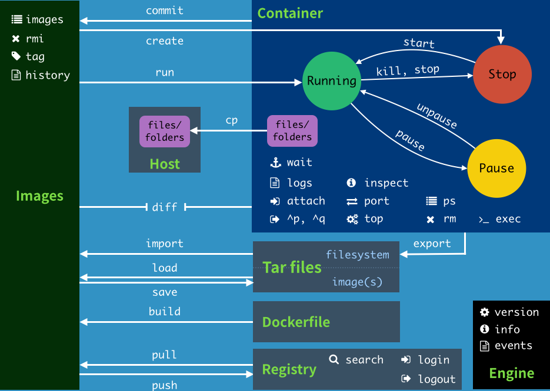

# Docker Manual

## Docker 常用命令

### **常用命令**

#### docker信息

```shell
docker version			# 显示docker的版本信息
docker info					# 显示docker的系统信息，包括镜像和容器的数量
docker 命令 --help	 # 查看命令文档
docker stats				# 查看CPU的状态
```


#### 镜像命令

说明：现有image才能创建container，container是image的实例，image是模版

```shell
# 查看所有主机上的的镜像
docker images
	- a 显示全部
	- q 只显示id
# 搜索镜像
docker seach 镜像名称

# 下载镜像 tags 指定版本， 没有tag 默认最新版本
docker pull 镜像[:tags]

# 删除镜像 -f 表示强制删除
docker rmi -f 镜像id	# 删除单个
docker rmi -f 镜像id 镜像id 镜像id	# 删除多个
docker rmi -f $(docker images -aq) # 删除全部镜像
```


#### 容器命令

```shell
# 新建容器并运行
docker run [可选参数] 镜像
	--name="Name"	# 容器名字，区分容器
	-d 						# 后台运行
	-it						# 交互模式
	-p						# 指定容器端口 -p 主机端口:容器端口 -p 8080:8080
	-P						# 随机指定端口

# 从容器中退回主机
exit 推出容器
ctrl-p-q 推出容器，但是容器继续运行

# 检查正在运行的容器
docker ps	# 正在运行的docker container
	-a 		  # 列出所有运行过的容器
	-n=?	  # 显示最近创建的？个容器
	-q		  # 只显示容器的编号
  

# 删除容器 -f 强制删除
docker rm 容器id		# 删除指定容器，不能删除正在运行的容器除非使用-f
docker rm -f $(docker ps -aq) # 删除所有的容器
docker ps -aq ｜ xargs docker rm # 通过管道过滤方式删除全部容器

# 启动和停止容器
docker start 容器id 		# 启动容器
docker restart 容器id		# 重启容器
docker stop 容器id			# 停止正在运行的容器
docker kill 容器id			# 强制停止当前的容器
```

#### 后台运行

```shell
# 命令
docker run -d

# 常见坑
docker容器运行在后台时，如果没有前台应用，那么就会自动停止docker
```

#### 查看日志

```shell
# 查看容器最近n条log
docker logs -f -t --tail n 容器id

# ex
docker run -d ubuntu /bin/sh -c "while true; echo hello world; sleep 1; done"
```

#### 查看容器中进程的信息

```shell
# 查看容器内进程的信息
docker top 容器id
```

#### 查看镜像的元数据

```shell
docker inspect 容器id
```


#### 进入正在运行的容器

```shell
# 容器通常在后台运行，需要进入容器，进行一些修改，-it表示交互
# 命令一
docker exec -it 容器id bashshell

# 命令二
docker attach 容器id

# docker exec 进入容器后开启新的终端
# docker attach 进入容器正在运行的终端
```

#### 从容器内拷贝内容到外部Host

```shell
# 只要container在，container里面的数据就在
# 命令
docker cp 容器id:容器内路径 目的主机路径

# 后期可以使用 -v volume技术实现自动拷贝数据
```

### docker命令小结

```shell
$ docker --help
                                                                                                                                   
用法:  docker COMMAND                                                                                                             
                                                                                                                                   
A self-sufficient runtime for containers                                                                                           
                                                                                                                                   
选项:                                                                                                                           
      --config string      Location of client config files (default                                                                
                           "C:\\Users\\junchow\\.docker")                                                                          
  -D, --debug              开启debug模式
  -H, --host list          Daemon socket(s) to connect to                                                                          
  -l, --log-level string   设置日志级别，级别分为debug|info|warn|error|fatal，默认为info。                                                                             
      --tls                Use TLS; implied by --tlsverify                                                                         
      --tlscacert string   Trust certs signed only by this CA (default                                                             
                           "C:\\Users\\junchow\\.docker\\machine\\machines\\default\\ca.pem")                                      
      --tlscert string     Path to TLS certificate file (default                                                                   
                           "C:\\Users\\junchow\\.docker\\machine\\machines\\default\\cert.pem")                                    
      --tlskey string      Path to TLS key file (default                                                                           
                           "C:\\Users\\junchow\\.docker\\machine\\machines\\default\\key.pem")                                     
      --tlsverify          Use TLS and verify the remote (default true)                                                            
  -v, --version            终端打印显示版本信息并退出                                                                                                                                   
管理命令:                                                                                                               
  config      管理Docker配置
  container   管理容器                                                                                                    
  image       管理镜像
  network     管理网络
  node        管理Swarm节点
  plugin      管理插件
  secret      管理Docker安全
  service     管理服务
  swarm       管理Swarm集群
  system      管理Docker系统
  trust       Manage trust on Docker images                                                                                        
  volume      管理卷
                                                                                                                                   
命令:                                                                                                                          
  attach      将标准输入和标准输出连接到正在运行的容器                                        
  build       使用dockerfile文件创建镜像                                                                                     
  commit      从容器的修改项中创建新的镜像
  cp          将容器的目录或文件复制到本地文件系统中
  create      创建一个新的镜像
  diff        检查容器文件系统的修改
  events      实时输出docker服务器中发生的事件
  exec        从外部运行容器内部的命令
  export      将容器的文件系统到处为tat文件包
  history     显示镜像的历史
  images      输出镜像列表
  import      从压缩为tar文件的文件系统中创建镜像
  info        显示当前系统信息、docker容器与镜像个数、设置信息等
  inspect     使用JSON格式显示容器与镜像的详细信息
  kill        向容器发送kill信号关闭容器
  load        从tar文件或标准输入中加载镜像
  login       登录docker注册服务器
  logout      退出docker注册服务器
  logs        输出容器日志信息
  pause       暂停容器中正在运行的所有进程
  port        查看容器的端口是否处于开放状态
  ps          输出容器列表
  pull        从注册服务器中拉取一个镜像或仓库
  push        将镜像推送到docker注册服务器
  rename      重命名一个容器
  restart     重启一个或多个容器
  rm          删除一个或多个容器，若没有指定标签则删除lastest标签。
  rmi         删除一个或多个镜像，若没有指定标签则删除lastest标签。                                                
  run         在一个新容器中中运行命令，用于指定镜像创建容器。
  save        将一个或多个镜像保存为tar包             
  search      从Docker Hub中搜索镜像
  start       启动一个或多个已经停止的容器
  stats       Display a live stream of container(s) resource usage statistics                                                      
  stop        停止一个或多个正在运行的容器
  tag         设置镜像标签
  top         显示容器中正在运行的进程信息
  unpause     重启pause命令暂停的容器
  update      更新一个或多个容器的配置
  version     显示docker版本信息
  wait        等待容器终止然后输出退出码                                                                                                                                   
Run 'docker COMMAND --help' for more information on a command.                                                                     
```





## Docker 镜像

### 特点：

* 使用联合文件系统
* 特点：
  * Docker镜像都是只读的，当容器启动时，一个新的可写层被加载到容器的顶部
  * 这一层是我们通常说的容器层，容器层之下都是镜像层


### 制作新的镜像

docker commit 可以将我们在容器层新添加的东西联合之前的镜像层打包一个新的docker

```shell
# docker commit 提交容器为一个新的副本 
docker commit -m="描述信息" -a="作者" 容器id 目标镜像名字:[TAG]

```


## 容器数据卷

### 什么是数据容器

如果数据都在容器中，那么当容器被删除之后，数据也会丢失。== 需求持久化 ==

容器之间可以共享数据的技术，即容器中产生的数据，同步到本地。== 挂在 ==

总结：

* 数据持久化
  * 即使容器被删除了，但是数据还在本地
* 数据同步化
* 容器间共享数据


### 使用数据卷

```shell
# 将数据卷挂在到外部
docker run -it -v 主机的目录地址:容器内的目录地址

# 利用inspect 查看容器的信息
docker inspect 容器id		# Mounts 参数
```


### 具名挂在和匿名挂在

```shell
# 匿名挂在，即不指定挂载的名字
docker run -d -P -v 容器内目录

# 具名挂在，即指定一个外部挂载的名字
docker run -d -P -v 卷名:容器内文件路径 # 注意这里只是卷名字，但是不是路径

# 未指定目录时，可以利用inspect来查看
docker inspect 容器id		# mount point 指明了挂载的路径

# 手册
docker volume --help

# 查看卷情况
docker volume ls

# 区分具名还是匿名挂载
-v 容器内文件路径		# 匿名
-v 卷名:容器内文件的路径	# 具名
-v 宿主机文件路径:容器内文件的路径	# 指定挂载路径

```

**拓展**

```shell
# 通过 -v 容器内文件路径:ro rw 改变读写权限
# ro read only
# rw read write
# 一旦设置了容器权限，容器对挂载出来的内容的操作是有权限的
# 例如：看到ro，说明路径内的文件只能从外部宿主机改变，不能从docker内部修改
docker run -d -P -v 容器内目录[:ro|:rw]
```


### 初识Dockerfile

Dockerfile就是用来构建docker镜像的文件，就是一段命令脚本。

通过这个脚本可以生成镜像。

```shell
# Dockerfile 简易脚本
# 创建文件中的内容，命令（大写）参数
# 每一层命令都是一层file
From centos

VOLUME ["volume01", "volume02"]	# 此处创建了两个数据卷，匿名挂载

CMD echo " ----- end ----- "
CMD /bin/bash

```

```shell
# 生产镜像
docker build -f /Path/dockerfile -t "Name:tag" . 
```


### 数据容器卷

多个容器共享并同步数据

```shell
# 通过 --volumes-from 从docker01 继承 volume，两者docker数据共享且同步
docker run -it --name docker01 --volumes-from docker01 image

# 即使docker01被删除，docker02共享的数据仍然存在
```

结论：

容器之间的配置信息传递，数据卷的生命周期一直持续到没有容器使用为止。

如果数据挂载到本地的话，那么数据卷会一直存在。


## Dockerfile

### 介绍

用来构建镜像的脚本。

构建步骤：

* 编写一个dockerfile
* 构建镜像：docker build
* 运行镜像：docker run
* 发布镜像：docker push


### 构建过程

基础知识

* 每个保留关键字（指令），都必须是大写
* 执行从上到下，按顺序执行
* "#" 表示注释
* 每一个指令构建一个新的镜像层，并提交


* dockerfile：构建文件，定义了一切的步骤，源码
* docker image：dockerfile生产的镜像，最终发布的产品
* docker container：docker image运行起来的服务实例


### Dockerfile的指令

```shell
FROM 		# 基础镜像，开始构建的地方 例如 centos
MAINTAINER	# 镜像是谁写的 （姓名+邮箱）
RUN 				# docker构建的时候需要运行的命令
ADD 				# 步骤，例如tomcat镜像，添加tomcat压缩包，ADD会自动解压
WORKDIR     # 镜像的工作目录
VOLUME			# 设置容器卷
EXPOSE			# 指定暴露端口
CMD 				# 指定这个容器启动的时候，运行的命令，只有最后一个会生效，且会被【替代】
ENTRYPOINT	# 可以【追加】命令
ONBUILD			# 当构建一个被继承的Dockerfile这个时候就会运行ONBUILD命令
COPY 				# 类似ADD，将我们的目录拷贝进入镜像
ENV					# 构建的时候设置环境变量
```


### 实战测试

DockerHub中99%都是从基础镜像来的 FROM scratch，然后配置需要的软件和设置来进行构造

> 创建一个自己的centos


```shell
# 编写文件
$ cat myDockerfile
FROM centos

MAINTAINER lvshd<shidonglyu@gmail.com>

ENV MYPATH /usr/local

WORKDIR $MYPATH

RUN yum -y install vim
RUN yum -y install net-tools

EXPOSE 80

CMD echo $MYPATH
CMD echo "----- Build Ends -----"
CMD /bin/bash

# 构建镜像
docker build -f dockerfile文件路径 -t 镜像名字:版本号 . # 注意要有一个点

# 查看构建历史 ===>> 可以研究其他人怎么做docker的
docker history 容器id
```

### 实战：构建tomcat

1. 准备镜像文件 tomcat压缩包和jdk（java）包
2. 编写dockerfile

```shell
FROM centos
MAINTAINER lvshd<shidonglyu@gmail.com>

COPY readme.txt /usr/local/readme.txt 	# 考本文件

ADD jdk压缩包 /usr/local
ADD tomcat压缩包 /usr/loca

RUN yum -y install vim

ENV MYPATH /usr/local
WORKDIR $MYPATH

ENV JAVA_HOME /usr/local/jdk1.8.0_11
ENV CLASSPATH $JAVA_PATH/lib/dt.jar:$JAVA_HOME/lib/tools.jar
ENV CATALINA_HOME /usr/local/apache-tomcat-9.0.22
ENV CATALINA_BASE /usr/local/apache-tomcat-9.0.22
ENV PATH $PATH:$JAVA_HOME/bin:$CATALINA_HOME/lib:$CATALINA_HOME/bin

EXPOSE 8080

CMD /usr/local/apache-tomcat-9.0.22/bin/startup.sh && tail -F /usr/local/apache-tomcat-9.0.22/bin/logs/catalina.out
```

3. 构建镜像

```shell
docker build -t diytomcat .
```

4. 启动
5. 访问测试
6. 发布项目（由于做了卷挂载，我们直接在本地编写项目就可以发布了）


### 发布镜像

> Docker Hub

1. 在Docker Hub上注册账号
2. 在自己的主机上提交自己的镜像

```shell
# 先登陆docker hub 账号
docker login --help

# push自己的镜像
docker push 镜像名字:版本号

# 修改镜像tag
docker tag 镜像id 新名字
```


### 小结


## Docker网络

> 原理

1. 每次启动一个docker容器，docker会给每一个容器分配一个ip。安装过docker，就会有一个docker0网卡桥接模式，使用的技术evth-pair技术。

**evth-pair技术**

* 就是一对虚拟设备接口，他们都是成对出现的，一段连着协议，一段彼此相连
* 充当一个桥梁，链接各种虚拟网络设备


2. docker启动了tomcat01和tomcat02 两者能相互ping通嘛？ 

* 可以相互ping通


* tomcat01和tomcat02公用一个路由器 --- docker0
  * 所有的docker容器在不指定网络的情况下都是由docker0路由器，docker会为每一个容器分配一个默认的可用ip地址

> 小结

* Docker利用的Linux桥接技术，宿主机中是一个Docker容器的网桥 docker0。所有的容器相关的通讯都会经过docker0。


* Docker中的所有的网络接口都是虚拟的。虚拟的转发效率高！（例如：内网传递）
* 当容器删除，对应的网桥就没了。


> 思考：编写一个微服务，database url:ip，ip可能会因为重启而改变，能否利用服务名字来改变。


### --link

在tomcat01中直接ping tomcat02（使用tomcat02名字）是无法ping通的。

```shell
# 利用link来链接两个容器
docker run -d -P --name tomcat01 tomcat #启动第一个容器
docker run -d -P --name tomcat02 --link tomcat01 tomcat #启动第二个容器，并连接第一个容器
docker exec -it tomcat02 ping tomcat01 #可以ping通

# 反向连接不行，docker01里面不能ping tomcat02（通过名字）

# docker network --help 查看网络相关的操作

# docker network inspect 网络id
```

**本质：**

通过查看tomcat02容器内的 /etc/hosts 可以发现，--link操作帮助tomcat02配置了tomcat01的ip地址，所以在tomcat02中访问tomcat01服务器名字是可以ping通的。

**真实开发**：

* 不建议使用--link 配置非常麻烦。
* 自定义网络，因为docker0不支持容器名称访问，需要自己手动配置。


### 自定义网络

> 查看所有的docker网络


**网络模式**

* bridge 桥接模式: 在docker上面搭桥，容器1和容器2通过docker0链接
  * 自定义网络也用桥接
* none: 不配置网络
* host 主机模式：和宿主机共享网络
* container：容器网络联通（很少用，局限很大）


测试

```shell
# 我们直接启动容器 --net bridge为默认参数，这个就是docker0
docker run -d -P --name tomcat01 tomcat
docker run -d -P --name tomcat01 --net bridge tomcat

# docker0特点：默认，域名不能访问，--link可以打通

# 我们可以自己定一个网络
docker network create --help

# -------------------------------------------------------------------
# --driver 网络类型
# --subnet 子网掩码 这里选择16 可以有255*255个虚拟设备
# --gateway 默认网关 192.168.0.1
# lsd @ lvshidongdeMBP in ~ [11:57:55] C:125
$ docker network create --driver bridge --subnet 192.168.0.0/16 --gateway 192.168.0.1 mynet
5ed08663cd65c72b3b7297a334aa5e67d3ce7d2e670b95efa49bcbda5452a553
(base)
# lsd @ lvshidongdeMBP in ~ [11:58:04]
$ docker network ls
NETWORK ID     NAME      DRIVER    SCOPE
aab81c70cb33   bridge    bridge    local
93f88f6df7c5   host      host      local
5ed08663cd65   mynet     bridge    local
d2b120da45f0   none      null      local

```

网络创建成功：


```shell
# 自定义网络测试
docker run -it -d -P --net mynet --name tomcat01 tomcat
docker run -it -d -P --net mynet --name tomcat02 tomcat

两者不用--link配置也可以通过容器名字相互访问
```


> 小结

* 把容器注册到自己的网络上，docker帮我自动维护对应关系。
* 好处：
  * redis 不同的集群使用不同的网络，保证集群的安全和健康
  * mysql 不同的集群使用不同的网络，保证集群的安全和健康


### 网络连通

使处于不同网络下的容器可以连接。

```shell
# 利用connect指令来创建连接
docker network connect --help

# 将容器连接到某个网络，连接之后可以和该网络中的其他容器进行通讯
docker network connect 网络id 容器id

# 可以实现一个容器两个ip
```


## Docker Compose

docker compose搞笑管理容器，定义运行多个服务。

> 官方定义

Compose is a tool for defining and running multi-container Docker applications. With Compose, you use a YAML file to configure your application’s services. Then, with a single command, you create and start all the services from your configuration. To learn more about all the features of Compose, see [the list of features](https://docs.docker.com/compose/#features).

Compose works in all environments: production, staging, development, testing, as well as CI workflows. You can learn more about each case in [Common Use Cases](https://docs.docker.com/compose/#common-use-cases).

Using Compose is basically a three-step process:

1. Define your app’s environment with a `Dockerfile` so it can be reproduced anywhere.
2. Define the services that make up your app in `docker-compose.yml` so they can be run together in an isolated environment.
3. Run `docker-compose up` and Compose starts and runs your entire app.

作用：批量容器管理


> 狂神的理解

Compose是docker官方开源的项目，需要安装。

Dockerfile让程序在任何地方运行。

Compose：重要概念

* 服务service，容器，应用（web mysql redis ... ）单个容器
* 项目project。一组关联的容器


