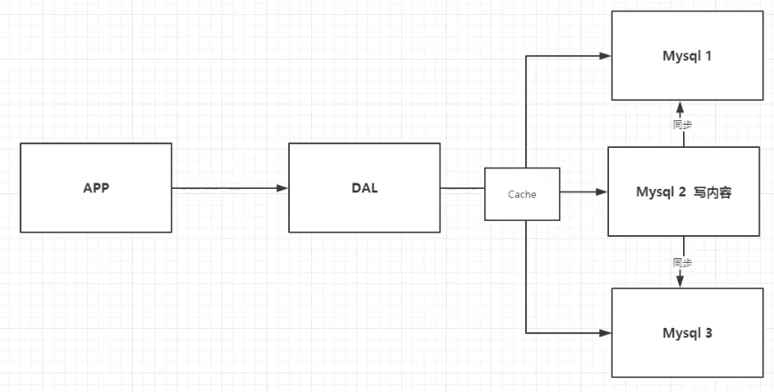
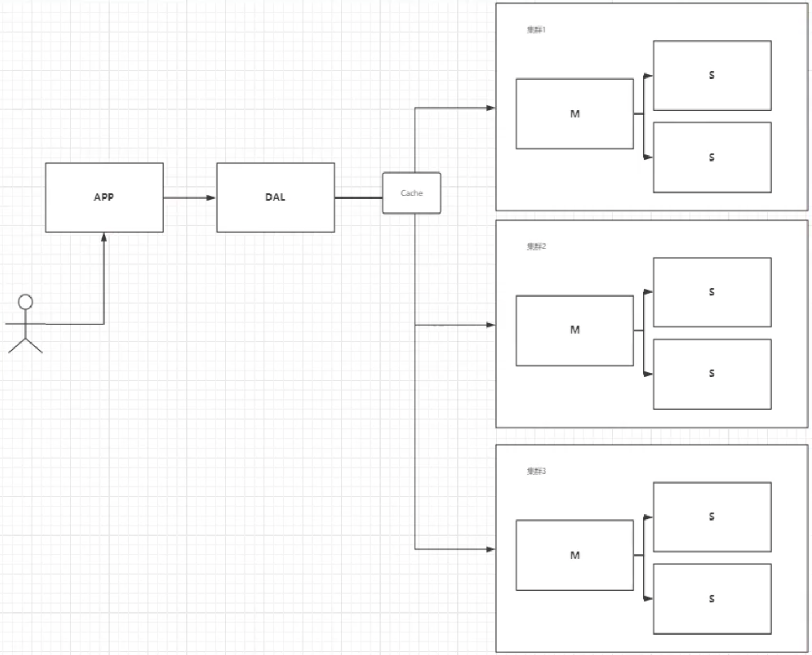
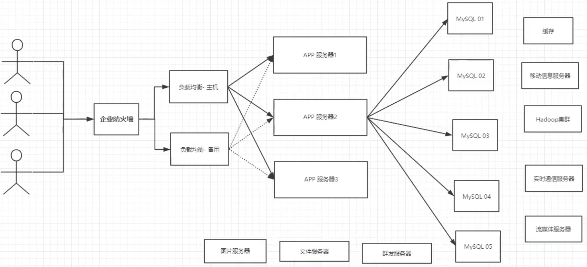
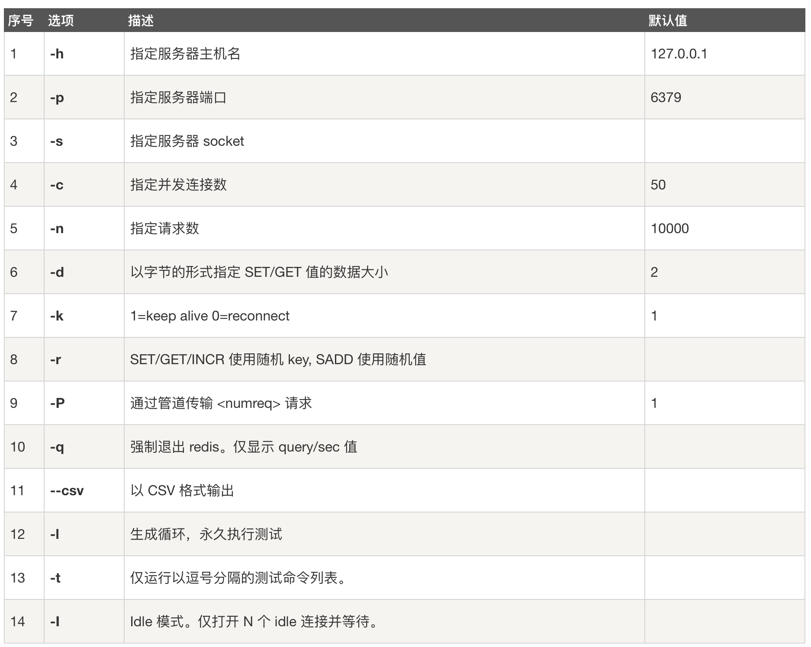
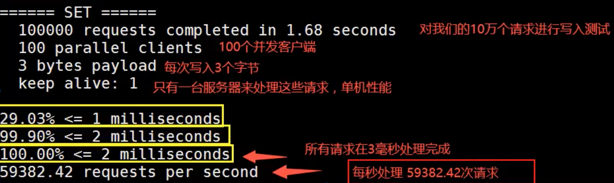
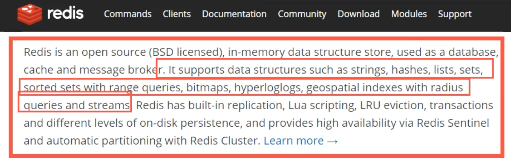

# Redis

## NoSQL概述

### 为什么要用Nosql

> 1 单机MySQL的年代


90年代，一个基本的网络访问量不会太大，单个数据库完全足够。

思考：整个网站的瓶颈是什么？

* 数据量太大、一台机器放不下
* 数据的索引（B+ Tree），一个机器内存放不下
* 访问量（读写混合），一个服务器承受不了

> 2 缓存 + MySQL + 垂直拆分（读写分离）

网站80%情况都在读，每次读都去查找数据库非常麻烦！使用缓存既保证效率也减轻数据库压力。

发展过程：优化数据结构和索引 --> 文件缓存（IO）--> 缓存（最热门的技术）



> 3 分库分表 + 水平拆分 +  MySQL集群

<font color="#dd0000">数据库本质: 读 + 写</font>

早些年MyISAM：表锁，十分影响效率！高并发情况下会出现严重锁问题

转战Innodb：行锁

慢慢开始使用分库分表来解决写的压力（根据不同的业务或者字段进行拆分）




> 4 最近的年代 2010 ---

MySQL等关系型数据库就不够用了！数据量很多，变化很快！

MySQL有时会用来存储较大的文件如博客、图片等，数据库表很大，效率很低。如果有一种数据库来专门处理这些数据，MySQL的压力就会变小。大数据的IO压力下，表几乎没法变大（已经有1E数据，再加一个列）。


> 5 目前一个基本的互联网项目




> 为什么要用NoSQL

* 用户的个人信息，社交网络，地理位置，用户自己产生的数据，用户日志等等爆发式增加
* NoSQL可以很好地处理以上的情况


### 什么是NoSQL

> NoSQL

NoSQL = Not Only SQL （不仅仅是SQL）泛指非关系型数据库。

关系型数据库: 表哥，行，列（POI）

Web2.0时代，高并发下关系型数据库无法满足要求。NoSQL迅速发展，Redis发展最快必须掌握。

很多的数据类型，如用户数据，社交网络，地理位置等。这些数据不需要一个固定的格式，不需要多余的操作就可以横向扩展。

> NoSQL 特点

* 方便扩展

  * 数据之间没有关系，好扩展。

* 大数据量，高性能。

  * Redis一秒可以写8w次，读取11w次（官方）
  * NoSQL的缓存记录级，是一种细粒度的缓存，性能较高

* 数据类型多样性

  * 不需要事先设计数据库，随取随用。数据量大的表很难设计。

* 传统RDBMS和NoSQL

  ```shell
  传统RDBMS
  	- 结构化组织 (表格)
  	- SQL
  	- 数据和关系都存在单独的表内
  	- 数据操作（增删改查），数据定义语言
  	- 严格的一致性
  	- ...
  ```

  ```shell
  NoSQL
  	- 不仅仅是数据
  	- 没有固定的查询语言
  	-	键值对存储，列存储，文档存储，图形数据库（社交关系）
  	- 最终一致性
  	- CAP定理和BASE理论 （异地多活）
  	- 高性能，高可用，高扩展性
  	- ...
  ```

> 了解：3V + 3高

大数据时代的3V：主要是描述问题的

1. 海量Volume
2. 多样Variety
3. 实时Velocity

大数据时代的3高：主要是对程序的要求

1. 高并发
2. 高可扩（随时水平拆分，机器不够，可以增加机器数量）
3. 高性能

真正的公司实践：NoSQL + RDBMS 一起使用。


**技术没有高低之分，看能如何使用。**

**技术急不得，越是慢慢学，才能越扎实！**

**开源才是技术的王道。**

**任何一家互联网公司，都不能只是让用户能用就行。**

* 大量公司做相同的业务（竞品协议）
* 竞争越来越大，业务越来越完善，对开发者要求更高

**架构师：没有什么是中间加一层不能解决问题的。**

**拓展资料**：王坚、多隆 [阿里云的那群疯子](https://zhuanlan.zhihu.com/p/46884081)


### NoSQL的四大分类

**KV键值对**

* 新浪：Redis
* 美团：Redis + Tair
* 阿里、百度：Redis + Memcached

**文档类型数据库**（bson格式和json一样）

* MongoDB（一般必须要掌握）
  * 基于分布式文件存储的数据库，C++编写，主要用来处理大量文档！
  * MongoDB是一个介于关系型数据库和非关系型数据库中间的产品。MongoDB是非关系型数据库中功能最丰富，最像关系型数据库的！
* ConthDB

**列存储数据库**

* HBase
* 分布式文件系统

**图形关系数据库**

* 不是存图型的，是存关系的。如，朋友圈，广告推荐。
* Neo4j，InfoGrid


> 四者对比


## Redis入门

### 概述

> Redis 是什么？

Redis （Remote Dictionary Server），即远程字典服务。


> Redis 能干嘛？

1. 内存存储、持久化（内存是断电即失，持久化非常重要 rdb aof）
2. 效率高，可以用于高速缓存
3. 发布订阅系统（简单的消息队列）
4. 地图信息分析
5. 计时器、计数器
6.  ......


> Redis 特性

1. Basic
   1. 开源由C语言编写
   2. 支持网络连接
   3. 可基于内存亦可持久化的日志型
   4. key-value类型数据库
   5. 多语言API
2. Advanced
   1. 多种数据类型
   2. 集群
   3. 事务操作
   4. 持久化


### 下载安装

1. 利用homebrew在mac上安装

   ```zsh
   # 安装redis
   brew install redis
   
   # homebrew 安装的目录 /usr/local/Cellar/
   
   # redis 配置文件在 /usr/local/etc
   
   # redis 可执行文件在 /usr/local/bin 有redis-benchmark redis-server redis-cli
   ```

   

2. 配置redis

   ```zsh
   # 进入redis.conf文件所在目录
   cd /usr/local/etc
   
   # 拷贝一份conf，因为我们要对conf进行修改
   cp redis.conf myredis.conf	
   
   # 修改redis.conf中的 daemonize参数（224行），从no改成yes，就可以在后台执行redis了
   ```

   

3. 启动redis服务

   ```zsh
   # 用自己的conf文件启动
   redis-server /usr/local/etc/myredis.conf
   
   # 用cli连接默认端口6379
   redis-cli -p 6379
   ```


4. 查看进程连接

   ```zsh
   $ ps -ef | grep redis
     501 98540     1   0  4:19PM ??         0:00.67 redis-server 127.0.0.1:6379
     501 98563 94985   0  4:19PM ttys000    0:00.01 redis-cli -p 6379
     501 98633 98572   0  4:23PM ttys003    0:00.00 grep --color=auto --exclude-dir=.bzr --exclude-dir=CVS --exclude-dir=.git --exclude-dir=.hg --exclude-dir=.svn redis
   ```

   

5. 关闭redis服务 `shutdown`

   ```zsh
   $ redis-cli -p 6379
   127.0.0.1:6379> ping
   PONG
   127.0.0.1:6379> shutdown NOSAVE
   not connected> exit
   $ 
   ```


### 性能测试

**redis-benchmark**是官方自带的性能测试工具。

> 测试质量（来自菜鸟）




> 简单测试

```zsh
# ceshi 100个并发连接 100000请求
redis-benchmark -h localhost -p 6379 -c 100 -n 100000
```




### Redis基础知识

> redis cli 基本操作

[官方文档](https://redis.io/commands)

```zsh
# 选择第几个数据库
select [number]

# 设置 key value
set key value

# 获取key的值
get key

# 查看所有的keys
key *

# 查看数据库大小
dbsize

# 清除当前数据库
flushdb

# 清除所有数据
flushall

# 判断key是否存在	返回1存在，0不存在
exists [key]		

# 移除当前的key
move key 1

# 设置当前key的过期时间
expire key seconds

# 检查当前key的剩余时间
ttl key

# 判断当前key的类型
type key

```

> redis相关知识

* redis默认有16个数据库
  * redis.conf中的database值为16
  * 默认使用第0个
* <font color="red">Redis单线程</font>
  * 原因：基于内存操作，CPU不是redis性能瓶颈，redis的瓶颈是根据机器的内存和网络带宽
* Redis由C语言编写
  * 官方数据为100000+的QPS，这个不比Memecache差！
* **Redis为什么这么快？**
  * 误区
    * 高性能的服务器一定是多线程（X）
    * 多线程（CPU）一定比单线程快 （X）
  * 核心：
    * 速度：CPU > 内存 > 硬盘
    * redis将所有的数据全部放到内存中的，所以使用单线程效率是最高的，多线程需要CPU上线文切换（耗时操作），对于内存来说，如果没有上下文切换效率就是最高的！多次读写都是在一个CPU上的，在内存情况下，这个是最佳方案。


## 五大数据类型

> 官方解释



作用：

* 数据库
* 缓存
* 消息中间件（消息队列）


### String（字符串）

> 基本使用方法

```zsh
####################################
# 1. 动态增加string，返回追加字符串后的总长度
set key1 v1
append key1 v2

127.0.0.1:6379> set name lsd
OK
127.0.0.1:6379> append name zjm	# 当前key不存在，就等同于新建
(integer) 6
127.0.0.1:6379> get name
"lsdzjm"
127.0.0.1:6379>
#####################################
# 2. 数据增和减 
incr key	# i++
decr key  # i--
incrby key step # i += step
decrby key step # i -= step

127.0.0.1:6379> set views 0
OK
127.0.0.1:6379> get views
"0"
127.0.0.1:6379> incr views
(integer) 1
127.0.0.1:6379> incr views
(integer) 2
127.0.0.1:6379> decr views
(integer) 1
127.0.0.1:6379>

#####################################
# 3. 获取string某一个范围的值
getrange key start end # 区间 [start, end]
getrange key 0 -1			 # 获取全部字符串 == get key

#####################################
# 4. 替换string指定位置之后的值
setrange key offset value

#####################################
# 5. 设置当前的值存在setex （set with expire） 设置过期时间
#    设置当前的值不存在setnx （set if not exist）如果不存在则设置
setex key seconds value
setnx key value 	# 不判断存在的话会自动覆盖之前的值（在分布式锁中经常使用）

#####################################
# 6. 批量设置和获取值
mset k1 v1 k2 v2 k3 v3
mget k1 k2 k3
msetnx k1 v1 k4 v4

#------------------------------------
127.0.0.1:6379> mset k1 v1 k2 v2
OK
127.0.0.1:6379> keys *
1) "k1"
2) "k2"
127.0.0.1:6379> mget k1 k2
1) "v1"
2) "v2"
127.0.0.1:6379> msetnx k1 v1 k3 v3	# 原子性操作，一个失败全部失败
(integer) 0
127.0.0.1:6379> get k3
(nil)
127.0.0.1:6379>
#------------------------------------
set user:1 {name:lsd, age:23} # 设置一个user:1对象，值为json字符来保存对象

# 这里的key是一种巧妙的设计：user:{id}:{field}

127.0.0.1:6379> mset user:1:name lsd user:1:age 23
OK
127.0.0.1:6379> mget user:1:name user:1:age
1) "lsd"
2) "23"
127.0.0.1:6379>

#####################################
# 7. 先get再set
getset key value

127.0.0.1:6379> getset db redis	# 如果不存在值则返回nil
(nil)
127.0.0.1:6379> get db
"redis"
127.0.0.1:6379> getset db mongodb # 如果存在值，则获取旧的值再设置新的值
"redis"
127.0.0.1:6379> get db
"mongodb"
127.0.0.1:6379>

#####################################

```


> String使用场景

* value除了是字符串还可以是数字
* 计数器
* 统计多单位的数量（关注数、收藏数、点赞数）
  * uid:{id}:follow 0 incr/decr
* 对象缓存数


### List

基本的数据类型，列表。可以变成栈、队列。

> 基本操作

List的相关操作全部是l开头

```zsh
#####################################
# 1. lpush 将元素放到list的头部（左边）
#    rpush 将元素放到list的尾部（右边） 
#    lrange 通过区间获取具体的值
127.0.0.1:6379> lpush list one
(integer) 1
127.0.0.1:6379> lpush list two
(integer) 2
127.0.0.1:6379> lpush list three
(integer) 3
127.0.0.1:6379> lrange list 0 -1
1) "three"
2) "two"
3) "one"
127.0.0.1:6379> lrange list 0 1
1) "three"
2) "two"
127.0.0.1:6379> rpush list four
(integer) 4
127.0.0.1:6379> lrange list 0 -1
1) "three"
2) "two"
3) "one"
4) "four"

#####################################
# 2. lpop 移除列表的第一个元素 左边
#    rpop 移除列表最后一个元素 右边
 
127.0.0.1:6379> lrange list 0 -1
1) "three"
2) "two"
3) "one"
4) "four"
127.0.0.1:6379> lpop list
"three"
127.0.0.1:6379> rpop list
"four"
127.0.0.1:6379> lrange list 0 -1
1) "two"
2) "one"

#####################################
# 3. lindex key index 获取列表中第index的值

127.0.0.1:6379> lrange list 0 -1
1) "two"
2) "one"
127.0.0.1:6379> lindex list 1
"one"

#####################################
# 4. llen key 获取列表的长度

127.0.0.1:6379> lpush list one
(integer) 1
127.0.0.1:6379> lpush list two
(integer) 2
127.0.0.1:6379> lpush list three
(integer) 3
127.0.0.1:6379> llen list
(integer) 3

#####################################
# 5. lrem key count element 移除指定个数的value

127.0.0.1:6379> lrange list 0 -1
1) "three"
2) "three"
3) "two"
4) "one"
127.0.0.1:6379> lrem list 1 one
(integer) 1
127.0.0.1:6379> lrange list 0 -1
1) "three"
2) "three"
3) "two"
127.0.0.1:6379> lrem list 2 three
(integer) 2
127.0.0.1:6379> lrange list 0 -1
1) "two"
127.0.0.1:6379>

#####################################
# 6. ltrim key start end 截断列表，只保留list的一部分

127.0.0.1:6379> lrange mylist 0 -1
1) "4"
2) "3"
3) "2"
4) "1"
127.0.0.1:6379> ltrim mylist 1 2
OK
127.0.0.1:6379> lrange mylist 0 -1
1) "3"
2) "2"

#####################################
# 7. rpoplpush source destination 移除列表的最后一个元素，并移到另外一个列表中
127.0.0.1:6379> lrange mylist 0 -1
1) "0"
2) "1"
3) "2"
127.0.0.1:6379> rpoplpush mylist otherlist
"2"
127.0.0.1:6379> lrange mylist 0 -1
1) "0"
2) "1"
127.0.0.1:6379> lrange otherlist 0 -1
1) "2"

#####################################
# 8. lset key index element 改变列表指定位置的值（前提是列表存在且指定位置有值，否则报错）
#    exists key 判断列表是否存在
127.0.0.1:6379> lpush list value
(integer) 1
127.0.0.1:6379> lset list 0 item
OK
127.0.0.1:6379> lrange list 0 0
1) "item"

#####################################
# 9. linsert key BEFORE|AFTER pivot element
#    在指定列表中的pivot前或者后插入元素
127.0.0.1:6379> lrange mylist 0 -1
1) "hello"
2) "world"
127.0.0.1:6379> linsert mylist before world other
(integer) 3
127.0.0.1:6379> lrange mylist 0 -1
1) "hello"
2) "other"
3) "world"
```


> 小结

* 把List当作是一个链表
* list中的所有值，空链表也代表不存在。
* 在两边插入或者改动值，效率比较高。中间元素操作效率低。
* 既可以当做队列也可以当做栈。


### Set（集合）

> 基本操作

* 值不可重复
* 无序
* 都以s开头

```zsh
#####################################
# 1. sadd key value 在set中增加值
#    smembers key 查看指定set的值
#    sismeber key value 判断set中是否有某个值
127.0.0.1:6379> sadd myset hello
(integer) 1
127.0.0.1:6379> sadd myset lsd
(integer) 1
127.0.0.1:6379> sadd myset zjm
(integer) 1
127.0.0.1:6379> smembers myset
1) "zjm"
2) "hello"
3) "lsd"
127.0.0.1:6379> sismember myset hello
(integer) 1
127.0.0.1:6379> sismember myset world
(integer) 0

#####################################
# 2. scard key 获取set中的值的个数

127.0.0.1:6379> scard myset
(integer) 3

#####################################
# 3. srem key value 删除集合中某个值
 
127.0.0.1:6379> srem myset hello
(integer) 1
127.0.0.1:6379> smembers myset
1) "zjm"
2) "lsd"

#####################################
# 4. srandmember key 随机获取集合中的值
#    sramdmember key count 随机获取集合中的count个值

127.0.0.1:6379> srandmember myset
"lsd"
127.0.0.1:6379> srandmember myset
"zjm"
127.0.0.1:6379> srandmember myset 2
1) "zjm"
2) "lsd"

#####################################
# 5. spop key 随机删除集合中的元素

#####################################
# 6. smove source destination member 将一个指定的值，移动到另外一个集合中

127.0.0.1:6379> smove myset myset2 lsd
(integer) 1
127.0.0.1:6379> smembers myset
1) "world"
2) "hello"
127.0.0.1:6379> smembers myset2
1) "zjm"
2) "lsd"

#####################################
# 7. 数字集合类
#    - 交集 - 差集 - 并集

127.0.0.1:6379> smembers key1
1) "c"
2) "b"
3) "a"
127.0.0.1:6379> smembers key2
1) "c"
2) "d"
3) "e"
127.0.0.1:6379> sdiff key1 key2	# 差集 
1) "a"
2) "b"
127.0.0.1:6379> sinter key1 key2 # 交集（如：共同好友）
1) "c"
127.0.0.1:6379> sunion key1 key2 # 并集
1) "c"
2) "d"
3) "a"
4) "b"
5) "e"
```

> 使用场景

* 微博，A用户将所有关注的人放到一个集合中
* 共同关注
* 共同好友，好友推荐


### Hash（哈希）

> 基本操作

* 想成Map集合，key-value 这个时候value是map集合
* 都以h开头
* 本质和string没啥区别，还是简单的key-value只是这里的value = <field, value>

```zsh
#####################################
# 1. 存值取值
127.0.0.1:6379> hset myhash field1 lsd	# 设置某个hash的某个字段的值
(integer) 1
127.0.0.1:6379> hget myhash field1	# 获取某个hash的某个字段的值
"lsd"
127.0.0.1:6379> hmset myhash field1 hello field2 world # 同时设置某个hash的多个字段的值
OK
127.0.0.1:6379> hmget myhash field1 field2 # 同时获取某个hash的多个字段的值
1) "hello"
2) "world"
127.0.0.1:6379> hgetall myhash	# 获取hash中所有的<field, value>对
1) "field1"
2) "hello"
3) "field2"
4) "world"

#####################################
# 2. 删除值，删除对应的field就删除了值
127.0.0.1:6379> hdel myhash field1
(integer) 1
127.0.0.1:6379> hgetall myhash
1) "field2"
2) "world"

#####################################
# 3. 获取hash表的长度 -- 字段数量

127.0.0.1:6379> hgetall myhash
1) "field2"
2) "world"
3) "field1"
4) "hello"
127.0.0.1:6379> hlen myhash
(integer) 2

#####################################
# 4. 判断hash中的字段是否存在

127.0.0.1:6379> hexists myhash field2
(integer) 1
127.0.0.1:6379> hexists myhash field3
(integer) 0

#####################################
# 5. 获得hash表中所有的字段/值

127.0.0.1:6379> hkeys myhash
1) "field2"
2) "field1"
127.0.0.1:6379> hvals myhash
1) "world"
2) "hello"

#####################################
# 6. hash表中字段的值自增自减，hsetnx / hsetex 如果不存在设置，如果存在设置（类似之前）
127.0.0.1:6379>  hset myhash field3 5
(integer) 1
127.0.0.1:6379> hincrby myhash field3 2
(integer) 7
127.0.0.1:6379> hsetnx myhash field1 haha
(integer) 0

```

> 使用场景

* hash变更数据，尤其是用户信息之类等经常变动的数据
  * hash更适合对象存储


### Zset（有序集合）

> 基本操作

* 在set的基础之上，增加一个值进行排序

```zsh
#####################################
# 1. 增加值

127.0.0.1:6379> zadd myset 1 one
(integer) 1
127.0.0.1:6379> zadd myset 2 two 3 three
(integer) 2
127.0.0.1:6379> zrange myset 0 -1
1) "one"
2) "two"
3) "three"

#####################################
# 2. 排序 zrangebyscore key min max [WITHSCORES] [LIMIT offset count]
#    1）zrangebyscore这个语法只能是最小值到最大值
#    2）zrevrange 这个语法是倒序
127.0.0.1:6379> zadd salary 2500 xiaohong
(integer) 1
127.0.0.1:6379> zadd salary 5000 zhangsan
(integer) 1
127.0.0.1:6379> zadd salary 500 lsd
(integer) 1
127.0.0.1:6379> zrangebyscore salary -inf +inf # 负无穷到正无穷范围
1) "lsd"
2) "xiaohong"
3) "zhangsan"
127.0.0.1:6379> zrangebyscore salary -inf +inf withscores # 输出带上值
1) "lsd"
2) "500"
3) "xiaohong"
4) "2500"
5) "zhangsan"
6) "5000"
127.0.0.1:6379> zrangebyscore salary -inf 2500 withscores # 限定范围
1) "lsd"
2) "500"
3) "xiaohong"
4) "2500"
#####################################
# 3. 删除某个值

127.0.0.1:6379> zrange salary 0 -1
1) "lsd"
2) "xiaohong"
3) "zhangsan"
127.0.0.1:6379> zrem salary xiaohong
(integer) 1
127.0.0.1:6379> zrange salary 0 -1
1) "lsd"
2) "zhangsan"
#####################################
# 4. zcard 获取集合中个数

127.0.0.1:6379> zrange salary 0 -1
1) "lsd"
2) "zhangsan"
127.0.0.1:6379> zcard salary
(integer) 2
#####################################
# 5. zcount统计区间内有多少个值

127.0.0.1:6379> zadd myset 1 lsd
(integer) 1
127.0.0.1:6379> zadd myset 2 zjm
(integer) 1
127.0.0.1:6379> zadd myset 3 love
(integer) 1
127.0.0.1:6379> zcount myset 1 2
(integer) 2
127.0.0.1:6379> zcount myset 1 3
(integer) 3

```


> 小结

* set 排序 存储班级成绩表、工资表表虚
* 设置权重：普通1 重要2
* 排行榜


## 事务操作

> 基本概念

Redis事务本质：

* 一组命令的集合。一个事务中的所有命令会被序列化，在执行过程中按照顺序执行。
* 一次性、顺序性、排他性。

MySQL: ACID。 原子性：要么同时成功，要么同时失败。

<font color="red">Redis单条命令是保证原子性的，但是事务不保证原子性！</font>

* redis事务没有隔离级别的概念
* 所有的命令在事务中，并没有直接被执行！只有发起执行命令的时候才会执行！Exec


Redis事务：

* 开启事务（multi）
* 命令入队（ ... ）
* 执行事务（exec）


> 正常执行事务

```zsh
127.0.0.1:6379> multi	# 开启事务
OK
# 命令入队
127.0.0.1:6379> set k1 v1
QUEUED
127.0.0.1:6379> set k2 v2
QUEUED
127.0.0.1:6379> get k2
QUEUED
127.0.0.1:6379> set k3 v3
QUEUED
127.0.0.1:6379> exec # 执行事务
1) OK
2) OK
3) "v2"
4) OK
```

> 放弃事务

```zsh
127.0.0.1:6379> multi	# 开启事务
OK
127.0.0.1:6379> set k1 v1
QUEUED
127.0.0.1:6379> set k2 v2
QUEUED
127.0.0.1:6379> set k4 v4
QUEUED
127.0.0.1:6379> discard # 取消事务
OK
127.0.0.1:6379> get k4 # 事务队列中的命令都不会被执行
(nil)
```

> 编译型异常（代码有问题，命令出错），事务中所有的命令都不会执行！

```zsh
127.0.0.1:6379> multi
OK
127.0.0.1:6379> set k1 v1
QUEUED
127.0.0.1:6379> set k2 v2
QUEUED
127.0.0.1:6379> getset k3 # 错误命令
(error) ERR wrong number of arguments for 'getset' command
127.0.0.1:6379> set k3 v3
QUEUED
127.0.0.1:6379> exec # 所有命令都不会执行
(error) EXECABORT Transaction discarded because of previous errors.
127.0.0.1:6379> get k1
(nil)
```


> 运行时异常（代码没问题，运行时出错），其他命令可以正常执行！错误命令跑出异常。

```zsh
127.0.0.1:6379> set k1 "v1"
OK
127.0.0.1:6379> multi
OK
127.0.0.1:6379> incr k1 
QUEUED
127.0.0.1:6379> set k2 v2
QUEUED
127.0.0.1:6379> exec # 虽然第一条命令失败了，但是第二条命令成功执行了
1) (error) ERR value is not an integer or out of range
2) OK
127.0.0.1:6379> get k2
"v2"
```


> 监控 Watch

**悲观锁**：

* 悲观，认为什么时候都会出问题（谨慎），无论做什么都加锁（影响性能）。

**乐观锁**：

* 乐观，认为什么时候都不会出现问题，所以不上锁！
* 更新数据的时候去判断一下，在此期间是否有人修改过这个数据。
* MySQL：
  * 获取version
  * 更新的时候比较version

> Redis检测测试

```zsh
# 正常执行成功
127.0.0.1:6379> set money 100
OK
127.0.0.1:6379> set out 0
OK
127.0.0.1:6379> watch money # 监视 money 对象
OK
127.0.0.1:6379> multi # 事务正常结束，数据期间没有发生变化，这个时候正常执行成功
OK
127.0.0.1:6379> decrby money 20
QUEUED
127.0.0.1:6379> incrby out 20
QUEUED
127.0.0.1:6379> exec
1) (integer) 80
2) (integer) 20

# 执行失败
# P1 ------------------------
127.0.0.1:6379> watch money
OK
127.0.0.1:6379> multi
OK
127.0.0.1:6379> decrby money 10
QUEUED
127.0.0.1:6379> incrby out 10
QUEUED

# p2 ------------------------
127.0.0.1:6379> get money
"80"
127.0.0.1:6379> set money 1000
OK

# p1 -------------------------
127.0.0.1:6379> exec # watch的money被其他客户端修好了，事务执行失败
(nil)

# 处理上述问题
127.0.0.1:6379> unwatch  # 发现事务失败，就先解锁
OK
127.0.0.1:6379> watch money # 重新上锁
OK
127.0.0.1:6379> multi 
OK
127.0.0.1:6379> decrby money 10
QUEUED
127.0.0.1:6379> incrby out 10
QUEUED
127.0.0.1:6379> exec # 再次执行事务（比对监视的值是否发生了变化，没有变化可以继续执行）
1) (integer) 990
2) (integer) 30
```


## Jedis

To Be Done


## Redis.conf详解

> 单位

配置文件 unit单位 大小写不敏感

> INCLUDES

包含其他配置文件

> Network

```zsh
# 绑定宿主机ip，默认本地ip，可以设置外部ip
bind 127.0.0.1

# 保护模式开启
protected-mode yes

# 宿主机端口
prot
```

> General

```zsh
# 以守护进程的方式运行，默认是no，自己设置为yes，这样才能后腰运行
daemonize yes

# 如果是后台运行方式，就需要指定一个pid文件
pidfile /var/run/redis_6379.pid

# 日志级别
# Specify the server verbosity level.
# This can be one of:
# debug (a lot of information, useful for development/testing)
# verbose (many rarely useful info, but not a mess like the debug level)
# notice (moderately verbose, what you want in production probably)生产环境
# warning (only very important / critical messages are logged)
loglevel notice

logfile "" # 生产日志名字

databases 16 # 数据库数量默认16

always-show-logo yes # 总是显示logo
```

> 快照

持久化，在规定的时间内执行多少操作，则会持久化道文件.rdb / .aof

redis是内存数据库，没有持久化，那么断电就失

```zsh
save 900 1 # 900秒内修改key至少一次，我们就持久化操作
save 300 10 # 300秒内修改key至少300，我们就持久化操作
save 60 10000 # 60秒内修改key至少10000，我们就持久化操作

# 之后持久化，我们可以自己定义测试！

stop-writes-on-bgsave-error yes # 持久化出错是否继续执行
rdbcompression yes # 是否压缩rdb持久化文件，需要消耗CPU资源
rdbchecksum yes # 保存rdb文件的时候进行错误校验

dir ./ # rdb文件保存的目录
```

> REPLICATION后面主从复值再写


> SECURITY 安全

为redis设置密码

```zsh
# 获取密码
config get requirepass
# 设置密码（默认没有密码）
config set requirepass passward
# 输入密码
auth passward
```

> CLIENT 客户端

```zsh
# 设置最大连接的客户端数量
maxclient 10000
# redis 配置最大内存容量
maxmemory <bytes> 
# 内存到达上限的时候的处理策略
maxmemory-policy noeviction
	# 移除一些过期key
	# ...
```

> APPEND ONLY 模式 aof配置

```zsh
# 默认不开启aof持久化，默认使用rdb模式，大部分情况下rdb够用了
appendonly no

# 持久化文件的名字
appendiflename "appendonly.aof"

# appendfsync always # 每次修改都会同步，速度慢消耗性能
appendfsync everysec # 每次执行一次sync，可能会丢失这一秒的值
# appendfsync no # 不执行同步， 操作系统自己同步数据，速度最快
```


## Redis持久化

