# Redis

## NoSQL概述

### 为什么要用Nosql

> 1 单机MySQL的年代


90年代，一个基本的网络访问量不会太大，单个数据库完全足够。

思考：整个网站的瓶颈是什么？

* 数据量太大、一台机器放不下
* 数据的索引（B+ Tree），一个机器内存放不下
* 访问量（读写混合），一个服务器承受不了

> 2 缓存 + MySQL + 垂直拆分（读写分离）

网站80%情况都在读，每次读都去查找数据库非常麻烦！使用缓存既保证效率也减轻数据库压力。

发展过程：优化数据结构和索引 --> 文件缓存（IO）--> 缓存（最热门的技术）


> 3 分库分表 + 水平拆分 +  MySQL集群

<font color="#dd0000">数据库本质: 读 + 写</font>

早些年MyISAM：表锁，十分影响效率！高并发情况下会出现严重锁问题

转战Innodb：行锁

慢慢开始使用分库分表来解决写的压力（根据不同的业务或者字段进行拆分）


> 4 最近的年代 2010 ---

MySQL等关系型数据库就不够用了！数据量很多，变化很快！

MySQL有时会用来存储较大的文件如博客、图片等，数据库表很大，效率很低。如果有一种数据库来专门处理这些数据，MySQL的压力就会变小。大数据的IO压力下，表几乎没法变大（已经有1E数据，再加一个列）。


> 5 目前一个基本的互联网项目


> 为什么要用NoSQL

* 用户的个人信息，社交网络，地理位置，用户自己产生的数据，用户日志等等爆发式增加
* NoSQL可以很好地处理以上的情况


### 什么是NoSQL

> NoSQL

NoSQL = Not Only SQL （不仅仅是SQL）泛指非关系型数据库。

关系型数据库: 表哥，行，列（POI）

Web2.0时代，高并发下关系型数据库无法满足要求。NoSQL迅速发展，Redis发展最快必须掌握。

很多的数据类型，如用户数据，社交网络，地理位置等。这些数据不需要一个固定的格式，不需要多余的操作就可以横向扩展。

> NoSQL 特点

* 方便扩展

  * 数据之间没有关系，好扩展。

* 大数据量，高性能。

  * Redis一秒可以写8w次，读取11w次（官方）
  * NoSQL的缓存记录级，是一种细粒度的缓存，性能较高

* 数据类型多样性

  * 不需要事先设计数据库，随取随用。数据量大的表很难设计。

* 传统RDBMS和NoSQL

  ```shell
  传统RDBMS
  	- 结构化组织 (表格)
  	- SQL
  	- 数据和关系都存在单独的表内
  	- 数据操作（增删改查），数据定义语言
  	- 严格的一致性
  	- ...
  ```

  ```shell
  NoSQL
  	- 不仅仅是数据
  	- 没有固定的查询语言
  	-	键值对存储，列存储，文档存储，图形数据库（社交关系）
  	- 最终一致性
  	- CAP定理和BASE理论 （异地多活）
  	- 高性能，高可用，高扩展性
  	- ...
  ```

> 了解：3V + 3高

大数据时代的3V：主要是描述问题的

1. 海量Volume
2. 多样Variety
3. 实时Velocity

大数据时代的3高：主要是对程序的要求

1. 高并发
2. 高可扩（随时水平拆分，机器不够，可以增加机器数量）
3. 高性能

真正的公司实践：NoSQL + RDBMS 一起使用。


**技术没有高低之分，看能如何使用。**

**技术急不得，越是慢慢学，才能越扎实！**

**开源才是技术的王道。**

**任何一家互联网公司，都不能只是让用户能用就行。**

* 大量公司做相同的业务（竞品协议）
* 竞争越来越大，业务越来越完善，对开发者要求更高

**架构师：没有什么是中间加一层不能解决问题的。**

**拓展资料**：王坚、多隆 [阿里云的那群疯子](https://zhuanlan.zhihu.com/p/46884081)


### NoSQL的四大分类

**KV键值对**

* 新浪：Redis
* 美团：Redis + Tair
* 阿里、百度：Redis + Memcached

**文档类型数据库**（bson格式和json一样）

* MongoDB（一般必须要掌握）
  * 基于分布式文件存储的数据库，C++编写，主要用来处理大量文档！
  * MongoDB是一个介于关系型数据库和非关系型数据库中间的产品。MongoDB是非关系型数据库中功能最丰富，最像关系型数据库的！
* ConthDB

**列存储数据库**

* HBase
* 分布式文件系统

**图形关系数据库**

* 不是存图型的，是存关系的。如，朋友圈，广告推荐。
* Neo4j，InfoGrid


> 四者对比


## Redis入门

### 概述

> Redis 是什么？

Redis （Remote Dictionary Server），即远程字典服务。


> Redis 能干嘛？

1. 内存存储、持久化（内存是断电即失，持久化非常重要 rdb aof）
2. 效率高，可以用于高速缓存
3. 发布订阅系统（简单的消息队列）
4. 地图信息分析
5. 计时器、计数器
6.  ......


> Redis 特性

1. Basic
   1. 开源由C语言编写
   2. 支持网络连接
   3. 可基于内存亦可持久化的日志型
   4. key-value类型数据库
   5. 多语言API
2. Advanced
   1. 多种数据类型
   2. 集群
   3. 事务操作
   4. 持久化


### 下载安装

1. 利用homebrew在mac上安装

   ```zsh
   # 安装redis
   brew install redis
   
   # homebrew 安装的目录 /usr/local/Cellar/
   
   # redis 配置文件在 /usr/local/etc
   
   # redis 可执行文件在 /usr/local/bin 有redis-benchmark redis-server redis-cli
   ```

   

2. 配置redis

   ```zsh
   # 进入redis.conf文件所在目录
   cd /usr/local/etc
   
   # 拷贝一份conf，因为我们要对conf进行修改
   cp redis.conf myredis.conf	
   
   # 修改redis.conf中的 daemonize参数（224行），从no改成yes，就可以在后台执行redis了
   ```

   

3. 启动redis服务

   ```zsh
   # 用自己的conf文件启动
   redis-server /usr/local/etc/myredis.conf
   
   # 用cli连接默认端口6379
   redis-cli -p 6379
   ```


4. 查看进程连接

   ```zsh
   $ ps -ef | grep redis
     501 98540     1   0  4:19PM ??         0:00.67 redis-server 127.0.0.1:6379
     501 98563 94985   0  4:19PM ttys000    0:00.01 redis-cli -p 6379
     501 98633 98572   0  4:23PM ttys003    0:00.00 grep --color=auto --exclude-dir=.bzr --exclude-dir=CVS --exclude-dir=.git --exclude-dir=.hg --exclude-dir=.svn redis
   ```

   

5. 关闭redis服务 `shutdown`

   ```zsh
   $ redis-cli -p 6379
   127.0.0.1:6379> ping
   PONG
   127.0.0.1:6379> shutdown NOSAVE
   not connected> exit
   $ 
   ```


### 性能测试

**redis-benchmark**是官方自带的性能测试工具。

> 测试质量（来自菜鸟）


> 简单测试

```zsh
# ceshi 100个并发连接 100000请求
redis-benchmark -h localhost -p 6379 -c 100 -n 100000
```


### Redis基础知识

> redis cli 基本操作

[官方文档](https://redis.io/commands)

```zsh
# 选择第几个数据库
select [number]

# 设置 key value
set key value

# 获取key的值
get key

# 查看所有的keys
key *

# 查看数据库大小
dbsize

# 清除当前数据库
flushdb

# 清除所有数据
flushall

# 判断key是否存在	返回1存在，0不存在
exists [key]		

# 移除当前的key
move key 1

# 设置当前key的过期时间
expire key seconds

# 检查当前key的剩余时间
ttl key

# 判断当前key的类型
type key

```

> redis相关知识

* redis默认有16个数据库
  * redis.conf中的database值为16
  * 默认使用第0个
* <font color="red">Redis单线程</font>
  * 原因：基于内存操作，CPU不是redis性能瓶颈，redis的瓶颈是根据机器的内存和网络带宽
* Redis由C语言编写
  * 官方数据为100000+的QPS，这个不比Memecache差！
* **Redis为什么这么快？**
  * 误区
    * 高性能的服务器一定是多线程（X）
    * 多线程（CPU）一定比单线程快 （X）
  * 核心：
    * 速度：CPU > 内存 > 硬盘
    * redis将所有的数据全部放到内存中的，所以使用单线程效率是最高的，多线程需要CPU上线文切换（耗时操作），对于内存来说，如果没有上下文切换效率就是最高的！多次读写都是在一个CPU上的，在内存情况下，这个是最佳方案。


## 五大数据类型

> 官方解释


作用：

* 数据库
* 缓存
* 消息中间件（消息队列）


### String（字符串）

> 基本使用方法

```zsh
####################################
# 1. 动态增加string，返回追加字符串后的总长度
set key1 v1
append key1 v2

127.0.0.1:6379> set name lsd
OK
127.0.0.1:6379> append name zjm	# 当前key不存在，就等同于新建
(integer) 6
127.0.0.1:6379> get name
"lsdzjm"
127.0.0.1:6379>
#####################################
# 2. 数据增和减 
incr key	# i++
decr key  # i--
incrby key step # i += step
decrby key step # i -= step

127.0.0.1:6379> set views 0
OK
127.0.0.1:6379> get views
"0"
127.0.0.1:6379> incr views
(integer) 1
127.0.0.1:6379> incr views
(integer) 2
127.0.0.1:6379> decr views
(integer) 1
127.0.0.1:6379>

#####################################
# 3. 获取string某一个范围的值
getrange key start end # 区间 [start, end]
getrange key 0 -1			 # 获取全部字符串 == get key

#####################################
# 4. 替换string指定位置之后的值
setrange key offset value

#####################################
# 5. 设置当前的值存在setex （set with expire） 设置过期时间
#    设置当前的值不存在setnx （set if not exist）如果不存在则设置
setex key seconds value
setnx key value 	# 不判断存在的话会自动覆盖之前的值（在分布式锁中经常使用）

#####################################
# 6. 批量设置和获取值
mset k1 v1 k2 v2 k3 v3
mget k1 k2 k3
msetnx k1 v1 k4 v4

#------------------------------------
127.0.0.1:6379> mset k1 v1 k2 v2
OK
127.0.0.1:6379> keys *
1) "k1"
2) "k2"
127.0.0.1:6379> mget k1 k2
1) "v1"
2) "v2"
127.0.0.1:6379> msetnx k1 v1 k3 v3	# 原子性操作，一个失败全部失败
(integer) 0
127.0.0.1:6379> get k3
(nil)
127.0.0.1:6379>
#------------------------------------
set user:1 {name:lsd, age:23} # 设置一个user:1对象，值为json字符来保存对象

# 这里的key是一种巧妙的设计：user:{id}:{field}

127.0.0.1:6379> mset user:1:name lsd user:1:age 23
OK
127.0.0.1:6379> mget user:1:name user:1:age
1) "lsd"
2) "23"
127.0.0.1:6379>

#####################################
# 7. 先get再set
getset key value

127.0.0.1:6379> getset db redis	# 如果不存在值则返回nil
(nil)
127.0.0.1:6379> get db
"redis"
127.0.0.1:6379> getset db mongodb # 如果存在值，则获取旧的值再设置新的值
"redis"
127.0.0.1:6379> get db
"mongodb"
127.0.0.1:6379>

#####################################

```


> String使用场景

* value除了是字符串还可以是数字
* 计数器
* 统计多单位的数量（关注数、收藏数、点赞数）
  * uid:{id}:follow 0 incr/decr
* 对象缓存数


### List

基本的数据类型，列表。可以变成栈、队列。

> 基本操作

List的相关操作全部是l开头

```zsh
#####################################
# 1. lpush 将元素放到list的头部（左边）
#    rpush 将元素放到list的尾部（右边） 
#    lrange 通过区间获取具体的值
127.0.0.1:6379> lpush list one
(integer) 1
127.0.0.1:6379> lpush list two
(integer) 2
127.0.0.1:6379> lpush list three
(integer) 3
127.0.0.1:6379> lrange list 0 -1
1) "three"
2) "two"
3) "one"
127.0.0.1:6379> lrange list 0 1
1) "three"
2) "two"
127.0.0.1:6379> rpush list four
(integer) 4
127.0.0.1:6379> lrange list 0 -1
1) "three"
2) "two"
3) "one"
4) "four"

#####################################
# 2. lpop 移除列表的第一个元素 左边
#    rpop 移除列表最后一个元素 右边
 
127.0.0.1:6379> lrange list 0 -1
1) "three"
2) "two"
3) "one"
4) "four"
127.0.0.1:6379> lpop list
"three"
127.0.0.1:6379> rpop list
"four"
127.0.0.1:6379> lrange list 0 -1
1) "two"
2) "one"

#####################################
# 3. lindex key index 获取列表中第index的值

127.0.0.1:6379> lrange list 0 -1
1) "two"
2) "one"
127.0.0.1:6379> lindex list 1
"one"

#####################################
# 4. llen key 获取列表的长度

127.0.0.1:6379> lpush list one
(integer) 1
127.0.0.1:6379> lpush list two
(integer) 2
127.0.0.1:6379> lpush list three
(integer) 3
127.0.0.1:6379> llen list
(integer) 3

#####################################
# 5. lrem key count element 移除指定个数的value

127.0.0.1:6379> lrange list 0 -1
1) "three"
2) "three"
3) "two"
4) "one"
127.0.0.1:6379> lrem list 1 one
(integer) 1
127.0.0.1:6379> lrange list 0 -1
1) "three"
2) "three"
3) "two"
127.0.0.1:6379> lrem list 2 three
(integer) 2
127.0.0.1:6379> lrange list 0 -1
1) "two"
127.0.0.1:6379>

#####################################
# 6. ltrim key start end 截断列表，只保留list的一部分

127.0.0.1:6379> lrange mylist 0 -1
1) "4"
2) "3"
3) "2"
4) "1"
127.0.0.1:6379> ltrim mylist 1 2
OK
127.0.0.1:6379> lrange mylist 0 -1
1) "3"
2) "2"

#####################################
# 7. rpoplpush source destination 移除列表的最后一个元素，并移到另外一个列表中
127.0.0.1:6379> lrange mylist 0 -1
1) "0"
2) "1"
3) "2"
127.0.0.1:6379> rpoplpush mylist otherlist
"2"
127.0.0.1:6379> lrange mylist 0 -1
1) "0"
2) "1"
127.0.0.1:6379> lrange otherlist 0 -1
1) "2"

#####################################
# 8. lset key index element 改变列表指定位置的值（前提是列表存在且指定位置有值，否则报错）
#    exists key 判断列表是否存在
127.0.0.1:6379> lpush list value
(integer) 1
127.0.0.1:6379> lset list 0 item
OK
127.0.0.1:6379> lrange list 0 0
1) "item"

#####################################
# 9. linsert key BEFORE|AFTER pivot element
#    在指定列表中的pivot前或者后插入元素
127.0.0.1:6379> lrange mylist 0 -1
1) "hello"
2) "world"
127.0.0.1:6379> linsert mylist before world other
(integer) 3
127.0.0.1:6379> lrange mylist 0 -1
1) "hello"
2) "other"
3) "world"
```


> 小结

* 把List当作是一个链表
* list中的所有值，空链表也代表不存在。
* 在两边插入或者改动值，效率比较高。中间元素操作效率低。
* 既可以当做队列也可以当做栈。


### Set（集合）

> 基本操作

* 值不可重复
* 无序
* 都以s开头

```zsh
#####################################
# 1. sadd key value 在set中增加值
#    smembers key 查看指定set的值
#    sismeber key value 判断set中是否有某个值
127.0.0.1:6379> sadd myset hello
(integer) 1
127.0.0.1:6379> sadd myset lsd
(integer) 1
127.0.0.1:6379> sadd myset zjm
(integer) 1
127.0.0.1:6379> smembers myset
1) "zjm"
2) "hello"
3) "lsd"
127.0.0.1:6379> sismember myset hello
(integer) 1
127.0.0.1:6379> sismember myset world
(integer) 0

#####################################
# 2. scard key 获取set中的值的个数

127.0.0.1:6379> scard myset
(integer) 3

#####################################
# 3. srem key value 删除集合中某个值
 
127.0.0.1:6379> srem myset hello
(integer) 1
127.0.0.1:6379> smembers myset
1) "zjm"
2) "lsd"

#####################################
# 4. srandmember key 随机获取集合中的值
#    sramdmember key count 随机获取集合中的count个值

127.0.0.1:6379> srandmember myset
"lsd"
127.0.0.1:6379> srandmember myset
"zjm"
127.0.0.1:6379> srandmember myset 2
1) "zjm"
2) "lsd"

#####################################
# 5. spop key 随机删除集合中的元素

#####################################
# 6. smove source destination member 将一个指定的值，移动到另外一个集合中

127.0.0.1:6379> smove myset myset2 lsd
(integer) 1
127.0.0.1:6379> smembers myset
1) "world"
2) "hello"
127.0.0.1:6379> smembers myset2
1) "zjm"
2) "lsd"

#####################################
# 7. 数字集合类
#    - 交集 - 差集 - 并集

127.0.0.1:6379> smembers key1
1) "c"
2) "b"
3) "a"
127.0.0.1:6379> smembers key2
1) "c"
2) "d"
3) "e"
127.0.0.1:6379> sdiff key1 key2	# 差集 
1) "a"
2) "b"
127.0.0.1:6379> sinter key1 key2 # 交集（如：共同好友）
1) "c"
127.0.0.1:6379> sunion key1 key2 # 并集
1) "c"
2) "d"
3) "a"
4) "b"
5) "e"
```

> 使用场景

* 微博，A用户将所有关注的人放到一个集合中
* 共同关注
* 共同好友，好友推荐


### Hash（哈希）

> 基本操作

* 想成Map集合，key-value 这个时候value是map集合
* 都以h开头
* 本质和string没啥区别，还是简单的key-value只是这里的value = <field, value>

```zsh
#####################################
# 1. 存值取值
127.0.0.1:6379> hset myhash field1 lsd	# 设置某个hash的某个字段的值
(integer) 1
127.0.0.1:6379> hget myhash field1	# 获取某个hash的某个字段的值
"lsd"
127.0.0.1:6379> hmset myhash field1 hello field2 world # 同时设置某个hash的多个字段的值
OK
127.0.0.1:6379> hmget myhash field1 field2 # 同时获取某个hash的多个字段的值
1) "hello"
2) "world"
127.0.0.1:6379> hgetall myhash	# 获取hash中所有的<field, value>对
1) "field1"
2) "hello"
3) "field2"
4) "world"

#####################################
# 2. 删除值，删除对应的field就删除了值
127.0.0.1:6379> hdel myhash field1
(integer) 1
127.0.0.1:6379> hgetall myhash
1) "field2"
2) "world"

#####################################
# 3. 获取hash表的长度 -- 字段数量

127.0.0.1:6379> hgetall myhash
1) "field2"
2) "world"
3) "field1"
4) "hello"
127.0.0.1:6379> hlen myhash
(integer) 2

#####################################
# 4. 判断hash中的字段是否存在

127.0.0.1:6379> hexists myhash field2
(integer) 1
127.0.0.1:6379> hexists myhash field3
(integer) 0

#####################################
# 5. 获得hash表中所有的字段/值

127.0.0.1:6379> hkeys myhash
1) "field2"
2) "field1"
127.0.0.1:6379> hvals myhash
1) "world"
2) "hello"

#####################################
# 6. hash表中字段的值自增自减，hsetnx / hsetex 如果不存在设置，如果存在设置（类似之前）
127.0.0.1:6379>  hset myhash field3 5
(integer) 1
127.0.0.1:6379> hincrby myhash field3 2
(integer) 7
127.0.0.1:6379> hsetnx myhash field1 haha
(integer) 0

```

> 使用场景

* hash变更数据，尤其是用户信息之类等经常变动的数据
  * hash更适合对象存储


### Zset（有序集合）

> 基本操作

* 在set的基础之上，增加一个值进行排序

```zsh
#####################################
# 1. 增加值

127.0.0.1:6379> zadd myset 1 one
(integer) 1
127.0.0.1:6379> zadd myset 2 two 3 three
(integer) 2
127.0.0.1:6379> zrange myset 0 -1
1) "one"
2) "two"
3) "three"

#####################################
# 2. 排序 zrangebyscore key min max [WITHSCORES] [LIMIT offset count]
#    1）zrangebyscore这个语法只能是最小值到最大值
#    2）zrevrange 这个语法是倒序
127.0.0.1:6379> zadd salary 2500 xiaohong
(integer) 1
127.0.0.1:6379> zadd salary 5000 zhangsan
(integer) 1
127.0.0.1:6379> zadd salary 500 lsd
(integer) 1
127.0.0.1:6379> zrangebyscore salary -inf +inf # 负无穷到正无穷范围
1) "lsd"
2) "xiaohong"
3) "zhangsan"
127.0.0.1:6379> zrangebyscore salary -inf +inf withscores # 输出带上值
1) "lsd"
2) "500"
3) "xiaohong"
4) "2500"
5) "zhangsan"
6) "5000"
127.0.0.1:6379> zrangebyscore salary -inf 2500 withscores # 限定范围
1) "lsd"
2) "500"
3) "xiaohong"
4) "2500"
#####################################
# 3. 删除某个值

127.0.0.1:6379> zrange salary 0 -1
1) "lsd"
2) "xiaohong"
3) "zhangsan"
127.0.0.1:6379> zrem salary xiaohong
(integer) 1
127.0.0.1:6379> zrange salary 0 -1
1) "lsd"
2) "zhangsan"
#####################################
# 4. zcard 获取集合中个数

127.0.0.1:6379> zrange salary 0 -1
1) "lsd"
2) "zhangsan"
127.0.0.1:6379> zcard salary
(integer) 2
#####################################
# 5. zcount统计区间内有多少个值

127.0.0.1:6379> zadd myset 1 lsd
(integer) 1
127.0.0.1:6379> zadd myset 2 zjm
(integer) 1
127.0.0.1:6379> zadd myset 3 love
(integer) 1
127.0.0.1:6379> zcount myset 1 2
(integer) 2
127.0.0.1:6379> zcount myset 1 3
(integer) 3

```


> 小结

* set 排序 存储班级成绩表、工资表表虚
* 设置权重：普通1 重要2
* 排行榜


## 事务操作

> 基本概念

Redis事务本质：

* 一组命令的集合。一个事务中的所有命令会被序列化，在执行过程中按照顺序执行。
* 一次性、顺序性、排他性。

MySQL: ACID。 原子性：要么同时成功，要么同时失败。

<font color="red">Redis单条命令是保证原子性的，但是事务不保证原子性！</font>

* redis事务没有隔离级别的概念
* 所有的命令在事务中，并没有直接被执行！只有发起执行命令的时候才会执行！Exec


Redis事务：

* 开启事务（multi）
* 命令入队（ ... ）
* 执行事务（exec）


> 正常执行事务

```zsh
127.0.0.1:6379> multi	# 开启事务
OK
# 命令入队
127.0.0.1:6379> set k1 v1
QUEUED
127.0.0.1:6379> set k2 v2
QUEUED
127.0.0.1:6379> get k2
QUEUED
127.0.0.1:6379> set k3 v3
QUEUED
127.0.0.1:6379> exec # 执行事务
1) OK
2) OK
3) "v2"
4) OK
```

> 放弃事务

```zsh
127.0.0.1:6379> multi	# 开启事务
OK
127.0.0.1:6379> set k1 v1
QUEUED
127.0.0.1:6379> set k2 v2
QUEUED
127.0.0.1:6379> set k4 v4
QUEUED
127.0.0.1:6379> discard # 取消事务
OK
127.0.0.1:6379> get k4 # 事务队列中的命令都不会被执行
(nil)
```

> 编译型异常（代码有问题，命令出错），事务中所有的命令都不会执行！

```zsh
127.0.0.1:6379> multi
OK
127.0.0.1:6379> set k1 v1
QUEUED
127.0.0.1:6379> set k2 v2
QUEUED
127.0.0.1:6379> getset k3 # 错误命令
(error) ERR wrong number of arguments for 'getset' command
127.0.0.1:6379> set k3 v3
QUEUED
127.0.0.1:6379> exec # 所有命令都不会执行
(error) EXECABORT Transaction discarded because of previous errors.
127.0.0.1:6379> get k1
(nil)
```


> 运行时异常（代码没问题，运行时出错），其他命令可以正常执行！错误命令跑出异常。

```zsh
127.0.0.1:6379> set k1 "v1"
OK
127.0.0.1:6379> multi
OK
127.0.0.1:6379> incr k1 
QUEUED
127.0.0.1:6379> set k2 v2
QUEUED
127.0.0.1:6379> exec # 虽然第一条命令失败了，但是第二条命令成功执行了
1) (error) ERR value is not an integer or out of range
2) OK
127.0.0.1:6379> get k2
"v2"
```


> 监控 Watch

**悲观锁**：

* 悲观，认为什么时候都会出问题（谨慎），无论做什么都加锁（影响性能）。

**乐观锁**：

* 乐观，认为什么时候都不会出现问题，所以不上锁！
* 更新数据的时候去判断一下，在此期间是否有人修改过这个数据。
* MySQL：
  * 获取version
  * 更新的时候比较version

> Redis检测测试

```zsh
# 正常执行成功
127.0.0.1:6379> set money 100
OK
127.0.0.1:6379> set out 0
OK
127.0.0.1:6379> watch money # 监视 money 对象
OK
127.0.0.1:6379> multi # 事务正常结束，数据期间没有发生变化，这个时候正常执行成功
OK
127.0.0.1:6379> decrby money 20
QUEUED
127.0.0.1:6379> incrby out 20
QUEUED
127.0.0.1:6379> exec
1) (integer) 80
2) (integer) 20

# 执行失败
# P1 ------------------------
127.0.0.1:6379> watch money
OK
127.0.0.1:6379> multi
OK
127.0.0.1:6379> decrby money 10
QUEUED
127.0.0.1:6379> incrby out 10
QUEUED

# p2 ------------------------
127.0.0.1:6379> get money
"80"
127.0.0.1:6379> set money 1000
OK

# p1 -------------------------
127.0.0.1:6379> exec # watch的money被其他客户端修好了，事务执行失败
(nil)

# 处理上述问题
127.0.0.1:6379> unwatch  # 发现事务失败，就先解锁
OK
127.0.0.1:6379> watch money # 重新上锁
OK
127.0.0.1:6379> multi 
OK
127.0.0.1:6379> decrby money 10
QUEUED
127.0.0.1:6379> incrby out 10
QUEUED
127.0.0.1:6379> exec # 再次执行事务（比对监视的值是否发生了变化，没有变化可以继续执行）
1) (integer) 990
2) (integer) 30
```


## Jedis

To Be Done


## Redis.conf详解

> 单位

配置文件 unit单位 大小写不敏感

> INCLUDES

包含其他配置文件

> Network

```zsh
# 绑定宿主机ip，默认本地ip，可以设置外部ip
bind 127.0.0.1

# 保护模式开启
protected-mode yes

# 宿主机端口
prot
```

> General

```zsh
# 以守护进程的方式运行，默认是no，自己设置为yes，这样才能后腰运行
daemonize yes

# 如果是后台运行方式，就需要指定一个pid文件
pidfile /var/run/redis_6379.pid

# 日志级别
# Specify the server verbosity level.
# This can be one of:
# debug (a lot of information, useful for development/testing)
# verbose (many rarely useful info, but not a mess like the debug level)
# notice (moderately verbose, what you want in production probably)生产环境
# warning (only very important / critical messages are logged)
loglevel notice

logfile "" # 生产日志名字

databases 16 # 数据库数量默认16

always-show-logo yes # 总是显示logo
```

> 快照

持久化，在规定的时间内执行多少操作，则会持久化道文件.rdb / .aof

redis是内存数据库，没有持久化，那么断电就失

```zsh
save 900 1 # 900秒内修改key至少一次，我们就持久化操作
save 300 10 # 300秒内修改key至少300，我们就持久化操作
save 60 10000 # 60秒内修改key至少10000，我们就持久化操作

# 之后持久化，我们可以自己定义测试！

stop-writes-on-bgsave-error yes # 持久化出错是否继续执行
rdbcompression yes # 是否压缩rdb持久化文件，需要消耗CPU资源
rdbchecksum yes # 保存rdb文件的时候进行错误校验

dir ./ # rdb文件保存的目录
```

> REPLICATION后面主从复值再写


> SECURITY 安全

为redis设置密码

```zsh
# 获取密码
config get requirepass
# 设置密码（默认没有密码）
config set requirepass passward
# 输入密码
auth passward
```

> CLIENT 客户端

```zsh
# 设置最大连接的客户端数量
maxclient 10000
# redis 配置最大内存容量
maxmemory <bytes> 
# 内存到达上限的时候的处理策略
maxmemory-policy noeviction
	# 移除一些过期key
	# ...
```

> APPEND ONLY 模式 aof配置

```zsh
# 默认不开启aof持久化，默认使用rdb模式，大部分情况下rdb够用了
appendonly no

# 持久化文件的名字
appendiflename "appendonly.aof"

# appendfsync always # 每次修改都会同步，速度慢消耗性能
appendfsync everysec # 每次执行一次sync，可能会丢失这一秒的值
# appendfsync no # 不执行同步， 操作系统自己同步数据，速度最快
```


## Redis持久化

面试和工作：持久化是重点。

Redis是内存数据库，如果不将内存中的数据库状态保存到磁盘，那么服务器进程退出，服务器中的数据库状态也会消失。所有redis需要有持久化的功能。

**RDB（Redis Database）**

> 什么是RDB

在主从复制中，rdb就是备用的！从机上面。

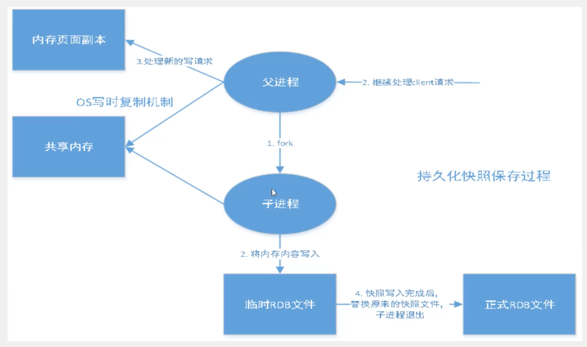

在指定的间隔时间内将内存中的数据集快照写入磁盘，它恢复时是将快照文件直接读到内存里。

Redis会单独fork一个子进程来进行持久化，会先将数据写入到一个临时文件中，持久化过程结束了，再利用这个临时文件替换上次持久化好的文件。整个过程中，祝进程不进行任何IO操作，这确保了极高的性能。如果需要进行大规模的数据恢复，且对于数据恢复的完整性并不是非常敏感，那RDB方式要比AOF方式更加高效。RDB的缺点是最后一次持久化后的数据可能丢失。我们默认是RDB，一般情况下不需要改这个配置。

rdb保存的文件是dump.rdb 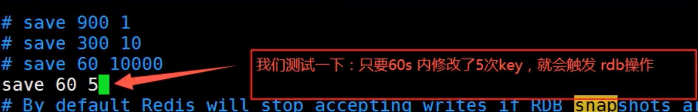

> 触发机制

1. save的规则满足的情况下，产生rdb问价
2. 执行flushall，产生rdb文件
3. 退出redis，会产生rdb文件

生成dump.rdb文件。

> 恢复rdb文件

1. 只要将dump.rdb文件放到配置文件夹下

2. 查看需要存放的位置，redis启动的时候会自动调用

   ```shell
   config get dir
   ```

> 优点和缺点

优点：

1. 适合大规模数据恢复
2. 对数据完整性要求不高

缺点：

1. 需要一定的时间间隔去进行操作！如果redis意外宕机，最后一次数据就会丢失
2. fork进程的时候，会占有一定的内存空间


**AOF（Append Only File）**

将我们所有的命令都记录下来，恢复的时候就把这个文件全部再执行一遍。

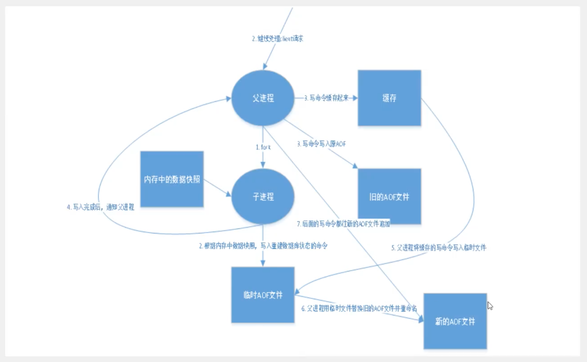

以日志的形式记录每个写操作，将Redis执行过的所有指令记录下来（读操作不记录），只许追加文件但不可以写文件，redis启动之初会读取该文件重新构造数据，换言之，redis重启的话就是根据日志文件的内容将内容将写指令从前到后执行一次以完成数据的恢复工作。

AOF保存的是appendonly.aof文件

> append

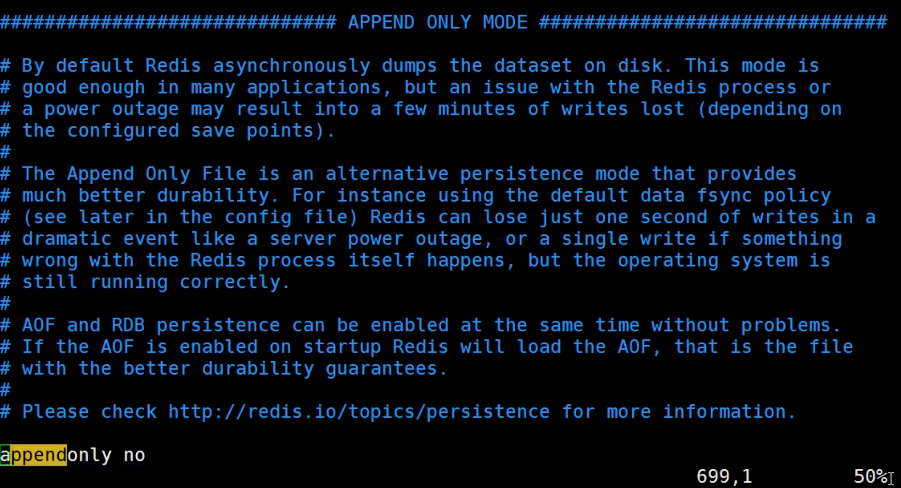

默认是不开启的，手动将appendonly设置成yes。 

重启redis就可以生效。

如果这个aof文件有错误，这时候redis是启动不了的，我们需要修复aof文件。

redis给我们提供一个工具。 Redis-check-aof --fix

```shell
redis-check-aof --fix appendonly.aof
```

如果文件修复正常，重启可以直接恢复（但是可能不能完全恢复到之前的aof）

> 重写规则

aof默认文件无限追加，文件越来越大。

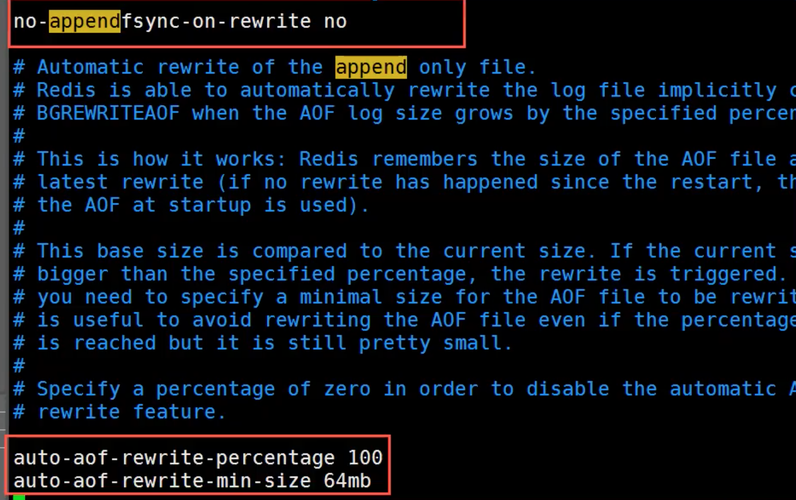

如果aof文件大于64m（参考配置文件内的aof-rewrite相关），fork一个新的进程来将我们的文件进行重写。

> 优点和缺点

```shell
# 默认不开启aof持久化，默认使用rdb模式，大部分情况下rdb够用了
appendonly no

# 持久化文件的名字
appendiflename "appendonly.aof"

# appendfsync always # 每次修改都会同步，速度慢消耗性能
appendfsync everysec # 每次执行一次sync，可能会丢失这一秒的值
# appendfsync no # 不执行同步， 操作系统自己同步数据，速度最快

# rewrite
```

优点:

1. 每一次修改都同步，文件的完整性更好
2. 每秒同步一次，可能会丢失一秒的数据
3. 从不同步，效率高

缺点：

1. 相对于数据文件来说，aof远远大于rdb，修复速度也比rdb慢
2. aof运行效率比rdb慢（I/O操作），rdb是默认


**扩展**

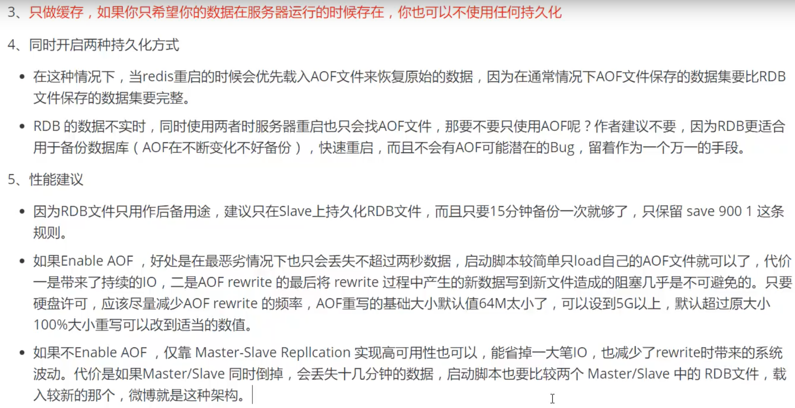


## Redis发布订阅

Redis发布订阅（pub/sub）是一种消息通讯模式：发布者(pub)发送小心，订阅者(sub)接受消息。

Redis客户端可以订阅人意数量的频道。

订阅/发布消息图：

第一个：消息的发送者，第二个：频道，第三个：消息订阅者。

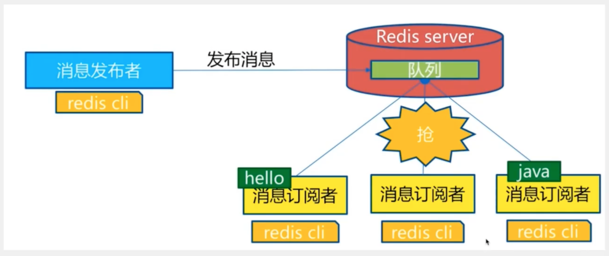

下图展示了频道 channel1 ， 以及订阅这个频道的三个客户端 —— client2 、 client5 和 client1 之间的关系：


当有新消息通过 PUBLISH 命令发送给频道 channel1 时， 这个消息就会被发送给订阅它的三个客户端：


> 命令

这些命令被广泛用于构建即时通讯应用，比如网络聊天室（chatroom）和实时广播、实时提醒。

```shell
# 1 订阅一个或者多个符合给定模式的频道
PSUBSCRIBE pattern [pattern ... ]

# 2 查看订阅与发布系统状态
PUBSUB subcommand [argument [argument ...]]

# 3 将消息发送到指定的频道
PUBLISH channel message

# 4 退订所有给定模式的频道
PUNSUBSCRIBE [pattern [pattern ...]]

# 5 订阅给定的一个或者多个频道的消息
SUBSCRIBE channel [channel ...]

# 6 只退订给定的频道
UNSUBSCRIBE [channel [channel ...]]
```


> 原理

Redis是使用C实现的，通过分析Redis源码里面的pubsub.c文件，了解发布和订阅机制的底层实现，借此加深对Redis的理解。

Redis通过PUBLISH、SUBSCRIBE和PSUBSCRIBE等命令实现发布和订阅功能。

通过SUBSCRIBE命令订阅某个频道后，redis-server里维护了一个字典，字典的键就是一个个channel，而字典的值则是一个链表，链表中保存了所有的订阅这个channel的客户端。SUBSCRIBE命令的关键，就是将客户端添加到给定channel的订阅链表中。

通过PUBLISH命令向订阅者发布消息，redis-server会使用给定的频道作为键，在它的维护的channel字典中查找这个记录了订阅这个频道的所有客户端的链表，遍历这个链表，将消息发送给所有的订阅者。

Pub/Sub从字面上理解就是发布和订阅，在redis中，你可以设定对某一个key值进行消息发布及消息订阅，当一个key值上进行消息发布之后，所有订阅它的客户端都会收到相应的消息。这一功能最明显的用法就是用作实时消息系统，比如普通的即使聊天，群聊等功能。

> 使用场景

1. 试试消息系统（网页，注册即subscribe）
2. 实时聊天（频道当做聊天室，将消息回显给所有人即可）
3. 订阅，关注系统都可以
4. 稍微复杂的场景会使用消息中间键，消息队列MQ


## Redis主从复制

### **概念**： 

主从复制是指将一台Redis服务器的数据，复制到其他redis服务器。前者称为主节点(master/leader)，后者称为从节点(slave/follower)。数据的复制是单向的，只能由主节点到从节点。Master以写为主，Slave以读为主。

==默认情况下，每台redis服务器都是主节点，且一个主节点可以有多个从节点(或者没有从节点)，但是一个从节点只能有一个主节点==。

**主从复制的作用主要包括**：

* 数据冗余：主从复制实现了数据的热备份，是持久化之外的一种数据冗余的方式。
* 故障恢复：当主节点出现问题的时候，可以由从节点提供服务，实现快速的故障恢复；实际上是一种服务的冗余。
* 负载均衡：在主从复制的基础上，配合读写分离，可以由主节点提供写服务，由从节点提供服务（即写redis数据时应用连接主节点，读Redis数据时应用连接从节点），分担服务器负载；尤其是在写少读多的场景下，通过多个从节点分担读负载，可以大大提升redis服务器的并发量。
* 高可用（集群）基石：除了以上作用外，主从复制还是哨兵和集群能够实施的基础，因此说主从复制是redis高可用的基础。

一般来说，将redis运用于工程项目中，只使用一台redis是万万不可以的（宕机），原因如下：

* 从结构上，单个redis服务器会发生单节点故障，并且一台服务器需要处理所有的请求使得负载压力较大；
* 从容量上，单个redis服务器内存容量有限，就算一台redis服务器的内存容量是256G，也不能将所有的内存作用redis存储，一般来说，==单台redis最大使用内存不应该超过20G。==

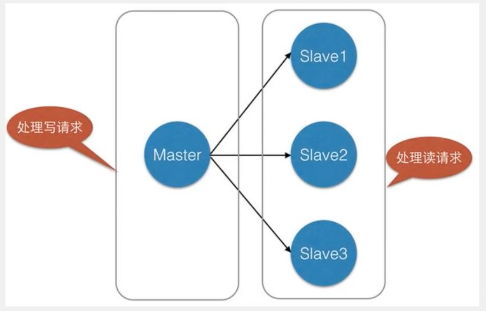

主从复制，读写分离。80%的情况下都是进行读操作。减轻服务器的压力，架构中经常使用，一主二从。

### 环境配置

只需要配置从节点，不需要配置主节点。

```shell
# 查看当前库的信息
info replication
```

复制三个配置文件，然后修改对应的配置信息

* 端口号port
* pidfile 对应port
* logfile log文件名字
* dump 备份文件名字

修改好之后启动：

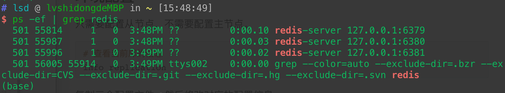

### 一主二从

==默认情况下，每个redis服务器都是主节点。==

我们只配置从机。主(79)二从(80,81)。

```shell
# 从机认主机
slaveof host port

# 主机查看从机
info replication
```

真实的主从复制应该在配置文件中修改(REPLICATION 相关)，通过命令修改的是暂时的。

 ==主机可以写，从机只能读。==

测试：

* 主机断开连接：从机依旧可以连接主机，但是没有写操作，这个时候，如果主机重新恢复之后，恢复到之前的状态。
* 从机断开连接：如果是使用命令行配置的主从关系，那么从机重启之后变回主机。如果重新变回从机，那么可以立即读取主机中的数据。

> 复制原理

Slave启动成功连接到master后会发出一个sync同步命令。

Master收到命令之后，启动后台的磁盘进程，同时手机所有接收到的用于修改数据集命令，在后台进程执行完毕之后，master将传输整个数据文件到slave，并完成一次完全同步。

**全量复制**：slave服务在接收到数据文件之后，将其存盘并加载到内存中。

**增量复制**：Master继续将新的所有手机的指令一次传输给slave，完成同步。

但是只要重新连接master，一次完全同步（全量复制）将被自动进行。

> 层层链路

上一个M连接下一个S，串联。

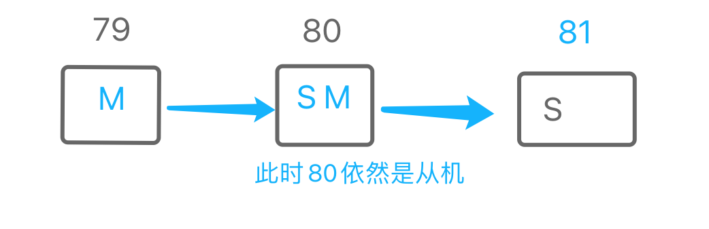

> 如果主机断开，可以手动设置一个新的主机（如果不使用哨兵模式）

```shell
# 从机变成主机
slaveof no one
```


### 哨兵模式

自动选举Master的模式。

> 概述

主从切换技术的方法是：当主机服务器宕机后，需要手动把一台服务器切换到主服务器。这就需要人工干预，费时费力，还会造成一段时间内服务器不可用。更多的时候，我们有限考虑哨兵模式。Redis从2.8开始正式提供了sentinel（哨兵）架构来解决这个问题。

哨兵模式能够后台监控主机是否故障，如果故障了根据票数==自动将从库转换为主库==。

哨兵模式是一种特殊的模式，首先redis提供了哨兵的命令，哨兵是一个独立的进程，作为进程，它将会独立运行。起原理是**哨兵通过发送命令，等待redis服务器响应，从而健康运行的多个redis实例**。

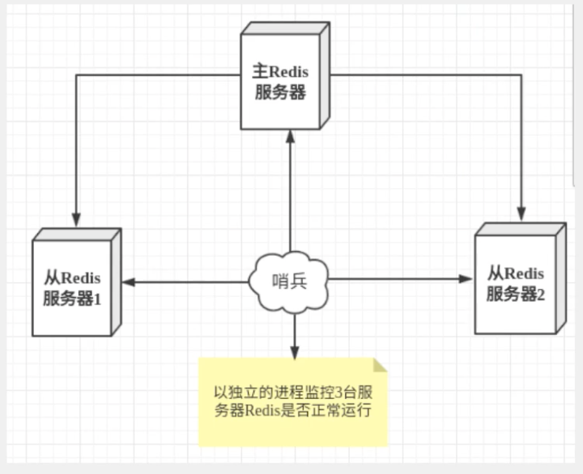

哨兵的两个作用

* 通过发送命令，让redis服务器返回监控其运行的状态，包括主服务器喝从服务器。
* 当哨兵检测到master宕机，会自动将slaver切换成master，然后通过**发布订阅模式**通知其他的从服务器，修改配置文件，让它们切换到主机。

然而一个哨兵进程对redis服务器监控可能会出现问题，为此，我们可以实现多个哨兵进行监控。各个哨兵之间还会进行监控，这样就形成了多哨兵的模式。

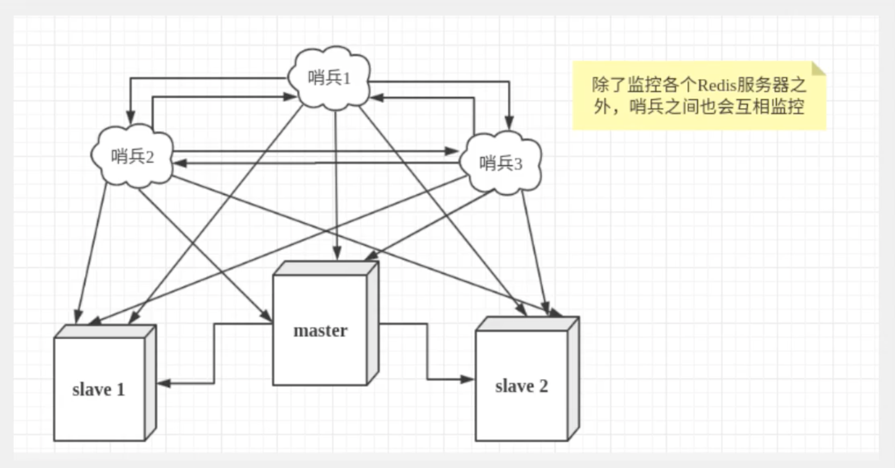

假设主服务器宕机，哨兵1先检测到这个结果，系统并不会马上进行failover过程，仅仅是哨兵1主管的认为服务器不可以用，这个现象成为**主观下线**。当后面的哨兵也检测到主服务器不可以用，并且数量达到一定值，那么哨兵之间就会进行一次投票，投票的结果是由一个哨兵发起的，进行failover[故障转移]操作。切换成功之后，就会通过发布订阅模式，让各个哨兵把自己监控的从服务器切换成主机，这个过程叫**客观下线**。

> 测试

目前配置，一主二从。

* 哨兵模式配置文件sentinel.conf

  ```shell
  #sentinel monitor 被监控的名字 host port 1
  sentinel monitor myredis 127.0.0.1 6379 1
  ```

  后面的数字1，代表主机挂了，slave投票看让谁接替成为主机，票数最多的，就会成为主机。

* 启动哨兵模式

  ```shell
  redis-sentinel sentinel.conf
  ```

如果master节点断开，这个时候就会从从机中选择一个服务器（内部有投票算法）

如果主机回来了，只能归并到新的主机下当做从机。

> 哨兵模式

优点：

* 哨兵集群，基于主从复制模块，所有的主从配置优点，它全有
* 主从可以切换，故障可以换一，系统的可用性更好
* 哨兵模式就是主从模式的升级，手动到自动，更加健壮

缺点：

* redis不好在线扩容，集群容量一点到达上限，在线扩容十分麻烦
* 实现哨兵模式的配置其实非常的麻烦，里面有很多的选择

```bash
# Example sentinel.conf
 
# 哨兵sentinel实例运行的端口 默认26379
# 如果是集群，需要为每一个单独配置端口
port 26379
 
# 哨兵sentinel的工作目录
dir /tmp
 
# 哨兵sentinel监控的redis主节点的 ip port 
# master-name  可以自己命名的主节点名字 只能由字母A-z、数字0-9 、这三个字符".-_"组成。
# quorum 当这些quorum个数sentinel哨兵认为master主节点失联 那么这时 客观上认为主节点失联了
# sentinel monitor <master-name> <ip> <redis-port> <quorum>
  sentinel monitor mymaster 127.0.0.1 6379 2
 
# 当在Redis实例中开启了requirepass foobared 授权密码 这样所有连接Redis实例的客户端都要提供密码
# 设置哨兵sentinel 连接主从的密码 注意必须为主从设置一样的验证密码
# sentinel auth-pass <master-name> <password>
sentinel auth-pass mymaster MySUPER--secret-0123passw0rd
 
 
# 指定多少毫秒之后 主节点没有应答哨兵sentinel 此时 哨兵主观上认为主节点下线 默认30秒
# sentinel down-after-milliseconds <master-name> <milliseconds>
sentinel down-after-milliseconds mymaster 30000
 
# 这个配置项指定了在发生failover主备切换时最多可以有多少个slave同时对新的master进行 同步，
这个数字越小，完成failover所需的时间就越长，
但是如果这个数字越大，就意味着越 多的slave因为replication而不可用。
可以通过将这个值设为 1 来保证每次只有一个slave 处于不能处理命令请求的状态。
# sentinel parallel-syncs <master-name> <numslaves>
sentinel parallel-syncs mymaster 1
 
 
 
# 故障转移的超时时间 failover-timeout 可以用在以下这些方面： 
#1. 同一个sentinel对同一个master两次failover之间的间隔时间。
#2. 当一个slave从一个错误的master那里同步数据开始计算时间。直到slave被纠正为向正确的master那里同步数据时。
#3.当想要取消一个正在进行的failover所需要的时间。  
#4.当进行failover时，配置所有slaves指向新的master所需的最大时间。不过，即使过了这个超时，slaves依然会被正确配置为指向master，但是就不按parallel-syncs所配置的规则来了
# 默认三分钟
# sentinel failover-timeout <master-name> <milliseconds>
sentinel failover-timeout mymaster 180000
 
# SCRIPTS EXECUTION
 
#配置当某一事件发生时所需要执行的脚本，可以通过脚本来通知管理员，例如当系统运行不正常时发邮件通知相关人员。
#对于脚本的运行结果有以下规则：
#若脚本执行后返回1，那么该脚本稍后将会被再次执行，重复次数目前默认为10
#若脚本执行后返回2，或者比2更高的一个返回值，脚本将不会重复执行。
#如果脚本在执行过程中由于收到系统中断信号被终止了，则同返回值为1时的行为相同。
#一个脚本的最大执行时间为60s，如果超过这个时间，脚本将会被一个SIGKILL信号终止，之后重新执行。
 
#通知型脚本:当sentinel有任何警告级别的事件发生时（比如说redis实例的主观失效和客观失效等等），将会去调用这个脚本，
这时这个脚本应该通过邮件，SMS等方式去通知系统管理员关于系统不正常运行的信息。调用该脚本时，将传给脚本两个参数，
一个是事件的类型，
一个是事件的描述。
如果sentinel.conf配置文件中配置了这个脚本路径，那么必须保证这个脚本存在于这个路径，并且是可执行的，否则sentinel无法正常启动成功。
#通知脚本
# sentinel notification-script <master-name> <script-path>
  sentinel notification-script mymaster /var/redis/notify.sh
 
# 客户端重新配置主节点参数脚本
# 当一个master由于failover而发生改变时，这个脚本将会被调用，通知相关的客户端关于master地址已经发生改变的信息。
# 以下参数将会在调用脚本时传给脚本:
# <master-name> <role> <state> <from-ip> <from-port> <to-ip> <to-port>
# 目前<state>总是“failover”,
# <role>是“leader”或者“observer”中的一个。 
# 参数 from-ip, from-port, to-ip, to-port是用来和旧的master和新的master(即旧的slave)通信的
# 这个脚本应该是通用的，能被多次调用，不是针对性的。
# sentinel client-reconfig-script <master-name> <script-path>
 sentinel client-reconfig-script mymaster /var/redis/reconfig.sh
```


## Redis缓存穿透和雪崩（面试高频，工作常用）

热地说缓存的使用，极大的提升了应用程序的性能和效率，特别是数据查询方面。但同时，它也带来了一些问题。其中，最致命的问题就是数据的一致性问题，从严格意义上讲，这个问题无解。如果对数据的一致性要求很高，那么就不用使用缓存。

另外的一些经典问题就是，缓存穿透、缓存雪崩和缓存击穿。目前，业界也都有比较流行的解决方案。

### 缓存穿透（查不到）

> 概念

缓存穿透的概念很简单，用户想要查询一个数据，发现redis内存数据库没有，也就是缓存没有命中，于是向持久数据库查询。发现也没有，于是本次查询失败。当用户很多的时候，缓存都没有命中，于是都去请求了持久层数据库。这会给持久层数据库造成很大的压力，这个时候就相遇出现了缓存穿透。

> 解决方案

**布隆过滤器**

布隆过滤器是一种数据结构，对所有可能查询的参数以hash形式存储，在控制层进行校验，不符合则丢弃，从而避免了底层存储系统的查询压力

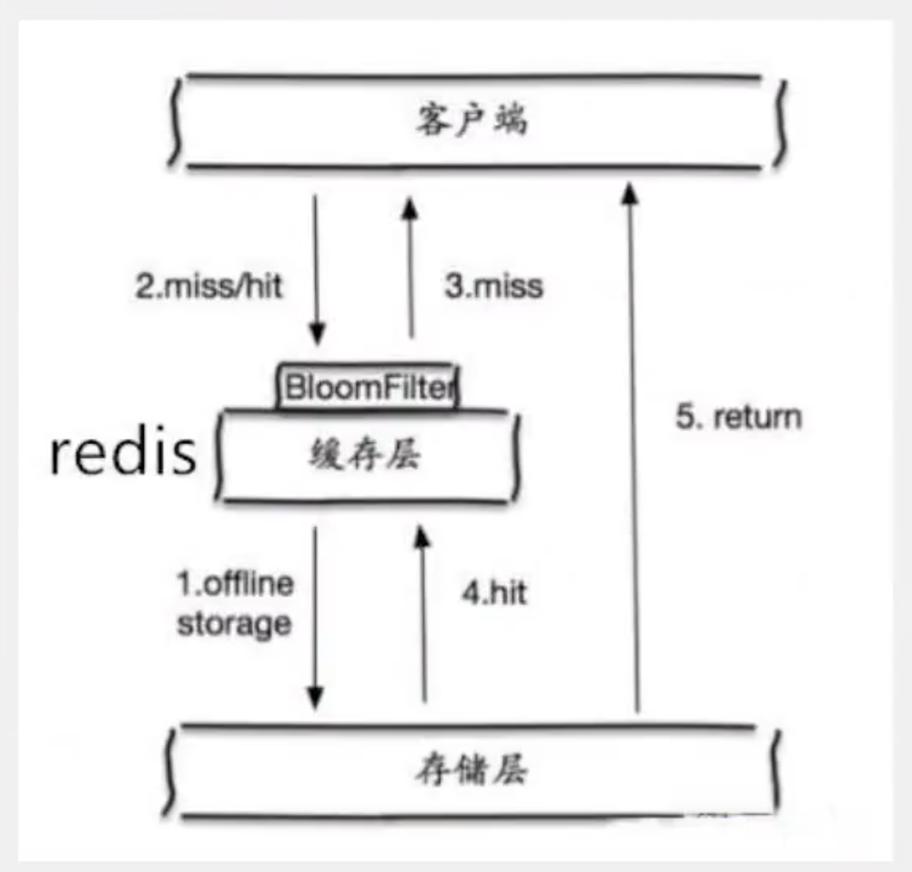


**缓存空对象**

当存储层不命中后，在缓存中存贮一个空对象，同时会设置一个过期时间之后再访问这个数据将会从缓存中获取，保护了后段数据源。

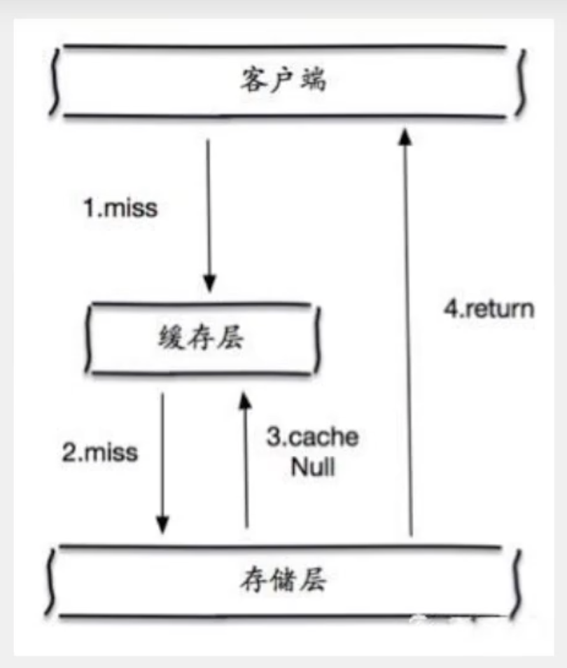

但是存在两个问题：

* 如果空值被存储起来，这就意味着缓存需要更多的空间去存储更多的键。
* 即使对空值设置了过期时间，还是会存在缓存层和存储层的数据会有一段时间的不一致，这对于要保持一致性的业务会有影响。


### 缓存击穿（量太大，缓存过期）

> 概述

这里需要注意和缓存穿透的区别。缓存击穿是指一个key非常热，在不停的扛着大并发，大并发集中对这一个点进行访问，当这个key在失效的瞬间，持续的大并发将击穿缓存，直接请求数据库，就像一个屏障上凿开了一个洞。

当某个key在过期的瞬间，有大量的请求并发访问，这类数据一般是一个热点数据，由于缓存过期，会同时造成访问数据库来查询最新数据，并且回写缓存，会使数据库压力过大。

> 解决方案

**设置热点数据不过期**

从缓存层面来看，没有设置过期时间，所以不会出现热点key过期后产生的问题。

**加互斥锁**

分布式锁：使用分布式锁，保证对于每一个key同时只有一个线程去查询后段服务，其他线程没有获得分布式锁的权限，因此只需要等待即可。这种方式将高并发的压力转移到了分布式锁，因此对分布式锁考研很大。


### 缓存雪崩

> 概念

缓存雪崩，是指在某一个时间段，缓存集中过期失效。Redis宕机。

产生雪崩的原因之一，比如双十二零点的抢购，这些商品时间比较集中的放入了缓存，假设缓存一个小时，那么到了凌晨一点的时候，这批次商品缓存全部过期了。而对这批次的商品访问全部落到了数据库上，对于数据库而言，这将产生周期性的压力波峰。于是所有的请求都会到达存储层，存储层的调用量会暴增，造成存储层也会挂掉的情况。

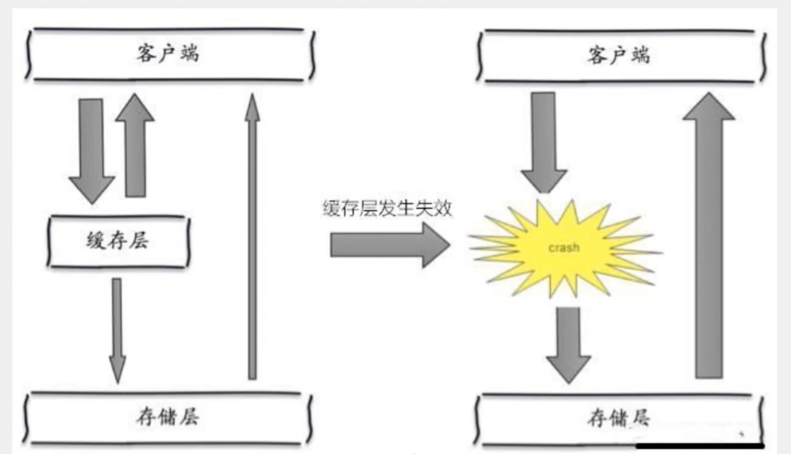

其实集中过期倒不是最致命的，比较致命的缓存雪崩是缓存服务器某个节点宕机或者断网。因此自然形成的缓存雪崩，一定是在某个时间段集中创建缓存，这个时候，数据库也是可以顶住压力的。无非就是对数据库产生周期性的压力而已。而缓存服务器节点的宕机，对数据库服务器造成的压力是不可预测的，很可能瞬间将数据压垮。

双十一：停掉一些次要服务器，来保证主要服务可用。

> 解决方案

**redis高可用**

这个思想的含义是，既然redis有可能挂掉，那我多增加几台redis，这样一台挂掉之后其他的还可以继续工作，其实就是在搭建集群。

**限流降级**

在缓存失效后，通过加锁或者队列来控制数据库写缓存的线程数量。比如对某个key只允许一个线程查询数据和写缓存，其他线程等待。

**数据预热**

数据预热的含义是在正式部署之前，我先把可用的数据预先访问一遍，这样部分可能大量访问的数据就会加载到缓存中。在即将发送大并发访问前手动出发加载缓存不同的key，设置不同的过期时间，让缓存失效的时间点进行均匀。


